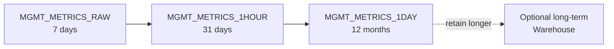

# OEM Repository

## Overview

The **OEM Repository** (or "OMR", Oracle Management Repository) is the database that OMS uses to store everything: metric history, incidents, jobs, credentials, targets, compliance results, blackout windows, and administrative metadata. All persistence for the console is here. Losing the repository = losing OEM.

It's a normal Oracle database. Any 19c EE DB will do. The repository holds several schemas — the primary one is **`SYSMAN`**.

## Sizing

For a medium fleet (500 targets, 100 DBs):

- **Datafile total**: ~300 GB (grows with target count and metric detail).
- **Redo**: ~500 MB × 3 groups (busy DB).
- **Undo**: 10 GB minimum.
- **Temp**: 20 GB.
- **SGA/PGA**: 16 GB / 8 GB minimum.
- **CPU**: 4–8 cores.

Rough scale-up per target: 500 MB / target / year, less with aggressive purging.

## Schemas Owned by OEM

| Schema        | Purpose                                   |
| ------------- | ----------------------------------------- |
| `SYSMAN`      | Main — metrics, targets, jobs, incidents. |
| `SYSMAN_MDS`  | Metadata service (workflow, forms).       |
| `SYSMAN_APM`  | Application performance monitoring.       |
| `SYSMAN_BIP`  | BI Publisher.                             |
| `SYSMAN_OPSS` | Oracle Platform Security Services.        |
| `SYSMAN_RO`   | Read-only role for reporting.             |
| `MGMT_VIEW`   | Reporting views on top of SYSMAN.         |
| `SYSMAN_APM`  | JVMD / ADP.                               |

Query all:

```sql
SELECT username, account_status, created
FROM   dba_users
WHERE  username LIKE 'SYSMAN%' OR username LIKE 'MGMT%'
ORDER  BY username;
```

## Key Tables

Massive schema — 3000+ objects. Some worth knowing:

| Table                     | Contains                        |
| ------------------------- | ------------------------------- |
| `MGMT_METRICS_RAW`        | Raw incoming metric datapoints. |
| `MGMT_METRICS_1HOUR`      | Hourly rollups.                 |
| `MGMT_METRICS_1DAY`       | Daily rollups.                  |
| `MGMT_TARGETS`            | Every registered target.        |
| `EM_CURRENT_AVAILABILITY` | Current up/down.                |
| `EM_EVENT_SEQUENCES`      | Incident timeline.              |
| `MGMT_JOB_EXECUTION`      | Job runs.                       |
| `MGMT_BLACKOUTS`          | Blackout windows.               |

Sizing check:

```sql
SELECT   segment_name, ROUND(SUM(bytes)/1024/1024/1024,2) AS gb
FROM     dba_segments
WHERE    owner = 'SYSMAN'
GROUP BY segment_name
ORDER BY 2 DESC
FETCH FIRST 20 ROWS ONLY;
```

## Metric Data Lifecycle

Metrics move through a rollup chain:



Default retention (13c):

- Raw: 7 days
- Hourly: 31 days
- Daily: 365 days

Change via Setup → Manage Cloud Control → Repository → Data Retention.

## Purging

OMS runs the purge job automatically. Force it:

```sql
BEGIN
  EMDW_LOG.set_context(EMDW_LOG.LEVEL_DEBUG);
  EM_METRIC_ADMIN.PURGE_RETENTION;
END;
/
```

Manual repository shrink after purge (rare):

```sql
ALTER TABLE SYSMAN.MGMT_METRICS_RAW MOVE ONLINE;
ALTER INDEX SYSMAN.MGMT_METRICS_RAW_PK REBUILD;
```

## Backup Strategy

**RMAN, like any critical DB**:

```
Full backup weekly.
Archivelog every 15 min offloaded to backup storage.
Retention: 30 days minimum.
Restore rehearsals: quarterly.
```

Data Guard is highly recommended — a repository loss is essentially a fresh OEM install unless you have a standby.

## Sizing Storage Fast

```sql
-- Total SYSMAN size
SELECT ROUND(SUM(bytes)/1024/1024/1024,2) gb
FROM   dba_segments WHERE owner='SYSMAN';

-- Growth over 30 days
SELECT ROUND((SUM(bytes) -
       (SELECT SUM(bytes) FROM dba_hist_seg_stat s2
        JOIN   dba_hist_snapshot h2 USING (snap_id)
        WHERE  s2.owner_name='SYSMAN'
          AND  h2.end_interval_time = (SELECT MIN(end_interval_time)
                                       FROM dba_hist_snapshot
                                       WHERE end_interval_time > SYSDATE - 30)))
       /1024/1024/1024,2) growth_gb
FROM   dba_hist_seg_stat s
JOIN   dba_hist_snapshot h USING (snap_id)
WHERE  s.owner_name='SYSMAN'
  AND  h.end_interval_time = (SELECT MAX(end_interval_time) FROM dba_hist_snapshot);
```

## Repository Maintenance Job

`EM_MAINT` — runs nightly, invoked by DBMS_SCHEDULER:

```sql
SELECT owner, job_name, state, next_run_date
FROM   dba_scheduler_jobs
WHERE  owner = 'SYSMAN' AND job_name LIKE 'EM_%';
```

Handles:

- Purge of raw / hourly / daily rollups per retention.
- Statistics refresh on hot SYSMAN tables.
- Deleted-target cleanup.
- Job execution history purge.

If it starts failing (job in `BROKEN` state), OMS console will get slow — investigate first.

## Repository Health SQL

```sql
-- Repository sessions from OMS (should match OMS heap threads)
SELECT COUNT(*) FROM v$session WHERE username='SYSMAN';

-- Purge job state
SELECT job_name, state, last_start_date, run_count, failure_count
FROM   dba_scheduler_jobs
WHERE  owner='SYSMAN' AND job_name = 'EM_MAINT'
   OR  job_name LIKE 'EM_MNTR%';

-- Top objects by size
SELECT segment_name, segment_type, ROUND(bytes/1024/1024/1024,2) gb
FROM   dba_segments
WHERE  owner='SYSMAN'
ORDER  BY bytes DESC
FETCH  FIRST 10 ROWS ONLY;
```

## Common Issues

- **SYSMAN tablespace fills up** — Retention too generous, or purge job broken. Extend + run purge.
- **`ORA-01555` on OMS reports** — Undo too small; a big rollup ran into a long report query.
- **OMS console painfully slow** — Stats stale on SYSMAN; gather with `DBMS_STATS.GATHER_SCHEMA_STATS('SYSMAN')`.
- **`EM_MAINT` job broken** — Enable and re-run manually; check `USER_SCHEDULER_JOB_RUN_DETAILS`.
- **Repository crashes with `ORA-00060` deadlocks** — OMS is doing bulk inserts against `MGMT_METRICS_RAW`; consider partitioning by hour.
- **Repository upgrade fails** — Missing catalog patches; must match OMS version exactly. See MOS Doc ID 2489053.1.

## Best Practices

1. Dedicated host for the repository.
2. 19c EE, latest RU.
3. RMAN backups + archivelog off-site.
4. Data Guard standby of the repository — high value insurance.
5. Retention: don't over-retain raw metrics.
6. Gather stats on SYSMAN weekly (`DBMS_STATS.GATHER_SCHEMA_STATS`).
7. Undo tablespace 10 GB minimum; retention 3600 s.
8. Monitor purge job in DBA_SCHEDULER_JOBS — if `BROKEN`, repository grows unbounded.
9. Never do DDL directly on SYSMAN tables — corrupts the schema.
10. Keep repository patch level ≥ OMS patch level.

## Interview Questions

1. **Q:** What is the repository schema?
   **A:** `SYSMAN` — plus companions like `SYSMAN_MDS`, `SYSMAN_APM`, `SYSMAN_BIP`.

2. **Q:** How does OEM roll up metrics?
   **A:** Raw → hourly → daily rollup tables, driven by scheduler jobs owned by SYSMAN.

3. **Q:** How would you back up the OEM repository?
   **A:** RMAN, exactly like any 19c DB. Plus a Data Guard standby for HA.

4. **Q:** SYSMAN tablespace is at 95%, how do you troubleshoot?
   **A:** Check `EM_MAINT` job state, retention settings, DBA_SEGMENTS for the biggest tables, run purge manually.

5. **Q:** OMS console is slow — what SQL do you run first?
   **A:** `DBMS_STATS.GATHER_SCHEMA_STATS('SYSMAN')` — stale stats are the #1 cause.

## References

- Oracle Enterprise Manager Cloud Control Administrator's Guide 13c
- MOS Doc ID 2489053.1 — OMR patch matrix
- MOS Doc ID 1518051.1 — OMR maintenance
- MOS Doc ID 1541126.1 — OMR high availability
