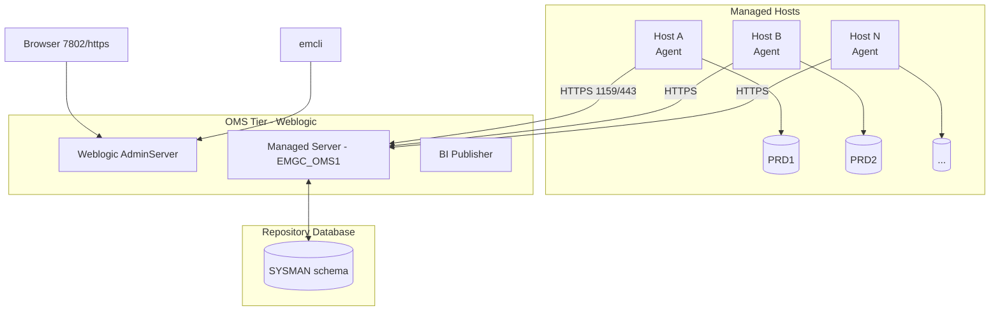

# Oracle Enterprise Manager (OEM)

## Overview

**Oracle Enterprise Manager (OEM)** is Oracle's centralized management platform for Oracle databases, middleware, engineered systems, cloud targets, and third-party apps. It's a three-tier product:

- **OMS** — Oracle Management Server (Weblogic-hosted web app and services).
- **Repository** — a database that stores metrics, jobs, configurations.
- **Agents** — small daemons on each managed host that push metrics up to the OMS.

The current mainline release is **OEM Cloud Control 13c**, with 13.5 being the last release supporting 19c fully in-scope, and 24c the current strategic release.

For DBAs, OEM provides:

- Consolidated monitoring across dozens/thousands of DBs.
- Performance Home / SQL Monitor / AWR viewer.
- Data Guard broker UI, RMAN backup jobs, patching automation, ASM UI.
- Compliance framework, security posture reporting.
- Corrective actions (auto-restart, auto-tablespace-extend).
- Notification framework (email, SNMP, ITSM connectors).

## Architecture



## Editions and Sizing

Editions have collapsed — 13c is a single edition. Sizing tiers:

| Deployment  | Targets   | OMS specs                               | Repo DB size |
| ----------- | --------- | --------------------------------------- | ------------ |
| Small       | < 100     | 2 CPU / 8 GB / 100 GB                   | 100 GB       |
| Medium      | 100–1000  | 4 CPU / 16 GB / 300 GB                  | 300 GB       |
| Large       | 1000–5000 | 8 CPU / 32 GB / 500 GB / 2 OMS nodes    | 1 TB         |
| Extra Large | 5000+     | 12+ CPU / 64+ GB / multi-OMS / repo RAC | 2+ TB        |

## Ports (Default)

| Port | Component                               |
| ---- | --------------------------------------- |
| 7802 | Console HTTPS (browser)                 |
| 7803 | Console HTTP (redirected)               |
| 4903 | Agent upload port                       |
| 1159 | Legacy agent upload (some old versions) |
| 3872 | Agent registration                      |
| 4889 | BI Publisher                            |

## Deployment Modes

- **Single OMS** — most sites; simple and adequate up to a few hundred targets.
- **Multi-OMS with SLB** — HA and horizontal scaling; a load balancer fronts the OMS nodes.
- **Repository RAC** — high availability for the repository DB.
- **OMR on a standby** — the repository has its own Data Guard for DR.

## Key Sub-Pages

| Page                                          | Purpose                                  |
| --------------------------------------------- | ---------------------------------------- |
| [OEM OMS](oem-oms.md)                         | Weblogic-based management server         |
| [OEM Repository](oem-repository.md)           | The SYSMAN database schema               |
| [OEM Agent](oem-agent.md)                     | Agent lifecycle, discovery, blackouts    |
| [OEM Troubleshooting](oem-troubleshooting.md) | Diagnosing OMS/Agent/Repository problems |

## What OEM Watches for a DB Target

Out of the box on a DB target:

- **Availability** — up/down every 60 s.
- **Alert log** monitoring — catches ORA-00600, 07445, 01578, etc.
- **Tablespace usage** — 85/95 % thresholds.
- **Wait class breakdown**.
- **Top SQL** by CPU, IO, elapsed.
- **Session metrics** — active, blocked, LIO/sec.
- **Backup status** — RMAN success/failure.
- **Data Guard lag** — apply/transport.
- **CPU / memory / IO** at the host level.

## `emcli` — Command-Line Client

```bash
emcli login -username=sysman
emcli sync

emcli get_targets -targets="oracle_database"
emcli execute_sql -targets="prd1:oracle_database" -sql="SELECT COUNT(*) FROM dba_users"
emcli list_target_properties -target_name="prd1"
emcli create_blackout -name="Q3_patch" -reason="Patching" -add_targets="prd1:oracle_database" -schedule="frequency:once;duration:2:0;start_time:2026-08-15 22:00"
```

## Notifications

Sinks OEM ships with:

- **SMTP** — email.
- **SNMP** — v1, v2c, v3.
- **PL/SQL procedure** — call custom logic in a database.
- **OS command** — shell out.
- **Ticketing connectors** — ServiceNow, BMC Remedy, JIRA.

Notification rules bind incident severity + target type + metric to a channel.

## Metric Extensions

Custom monitoring beyond built-ins:

```sql
-- Example: monitor open orders older than 5 minutes
SELECT COUNT(*) FROM orders
WHERE status='PENDING' AND created > SYSDATE - 5/1440;
```

Wrap this SQL as a **Metric Extension** in OEM UI; assign to targets; define warning/critical thresholds; wire to notifications.

## Compliance Framework

Built-in security & configuration standards:

- CIS Oracle Database 19c Benchmark
- STIG Oracle Database 12c/19c
- Oracle Database Security Technical Implementation Guide

OEM auto-evaluates targets against selected standards, produces a score, and flags drift.

## Reference Deployment Layout (Medium Site)

```
Node 1: OMS1  (Weblogic + collectors, HTTPS 7802)
Node 2: OMS2  (identical, behind F5 VIP)
Node 3: OMR   (SYSMAN repository DB, 19c CDB with EMREP PDB)
+ Agents on every managed host (400 hosts × 1–4 DBs each)
```

## Common Issues (Quick Reference — see [OEM Troubleshooting](oem-troubleshooting.md))

- Agents show **UNREACHABLE** — network firewall / SSL cert / clock skew.
- OMS won't start — Weblogic AdminServer stuck, credential store corruption.
- Metric collection lag — repository IO saturated.
- Targets stuck **METRIC COLLECTION ERROR** — agent bounce needed.

## Best Practices

1. Deploy OMS in HA (multi-OMS + SLB) once you cross ~200 targets.
2. Repository DB on **its own** host — don't share with the managed workload.
3. Enable Auto TLS certificate rotation.
4. Use `emcli` for scripted admin — clicks don't audit well.
5. Version-control your Metric Extensions and Compliance Standards.
6. Baseline notifications carefully; noisy monitoring gets ignored.
7. Blackouts before every patch/upgrade — every time.
8. Purge repository regularly (`emctl purge`) or the SYSMAN schema explodes.
9. Back up the repository with RMAN just like any critical DB.
10. Monitor OMS itself — the "who monitors the monitor" problem.

## Interview Questions

1. **Q:** What are the three tiers of OEM?
   **A:** OMS (Weblogic app), Repository (Oracle DB), Agents (on each managed host).

2. **Q:** Which OEM release supports 19c?
   **A:** 13.4 minimum, 13.5 is fully supported; 24c is current strategic.

3. **Q:** How does an agent send metrics to the OMS?
   **A:** HTTPS POST to the OMS upload endpoint (default port 4903), signed with the agent's certificate.

4. **Q:** What is a Metric Extension?
   **A:** A custom SQL/shell metric collected by OEM alongside built-ins, with thresholds and notifications.

5. **Q:** How do you blackout a target during patching from a script?
   **A:** `emcli create_blackout -name=... -reason=... -add_targets=... -schedule=...`.

## References

- Oracle Enterprise Manager Cloud Control Administrator's Guide 13c
- MOS Doc ID 2101223.2 — OEM 13.5 Master Note
- MOS Doc ID 2418493.1 — OEM 24c overview
- `emcli` command reference
