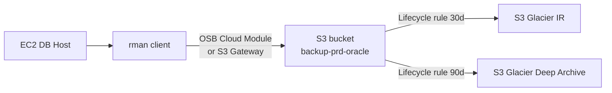

# AWS EC2 — Backup Strategy

## Overview

Oracle on EC2 uses **RMAN** — same as on-prem — with backup pieces landing in **S3** (via S3 Gateway or direct with OSB Cloud Module). Use lifecycle rules to tier to Glacier for long-term retention.

## Reference Setup



## Options

### Option 1: RMAN + OSB Cloud Module for S3

Oracle Secure Backup Cloud Module (OSB Cloud) makes RMAN write natively to S3.

Install:

```bash
# Download the JAR from OTN
java -jar osbws_install.jar \
     -AWSID <access_key> -AWSKey <secret> \
     -otnUser <otn_user> -otnPass <otn_pass> \
     -walletDir /home/oracle/osbws_wallet -libDir $ORACLE_HOME/lib
```

RMAN config:

```
CONFIGURE CHANNEL DEVICE TYPE 'SBT_TAPE'
   PARMS 'SBT_LIBRARY=/u01/app/oracle/product/19.0.0/dbhome_1/lib/libosbws.so,
   ENV=(OSB_WS_PFILE=/home/oracle/osbws_wallet/osbws.ora)'
   FORMAT '<backup_id>_%s_%p_%t';

CONFIGURE ENCRYPTION FOR DATABASE ON;
CONFIGURE COMPRESSION ALGORITHM 'MEDIUM';
```

### Option 2: RMAN to local /u03/fra + AWS CLI to S3

Simpler; two-step but familiar:

```bash
rman target / <<EOF
CONFIGURE CONTROLFILE AUTOBACKUP ON;
CONFIGURE RETENTION POLICY TO RECOVERY WINDOW OF 14 DAYS;
BACKUP INCREMENTAL LEVEL 0 DATABASE PLUS ARCHIVELOG DELETE INPUT;
BACKUP CURRENT CONTROLFILE;
EOF

aws s3 sync /u03/fra/PRD/backupset/$(date +%Y_%m_%d) s3://backup-prd-oracle/PRD/$(date +%Y_%m_%d)/
```

### Option 3: FSx for NetApp ONTAP + snapshot integration

If you're on FSx, use SnapCenter for Oracle. Reserved for larger enterprises.

## Recommended RMAN Config

```
CONFIGURE RETENTION POLICY TO RECOVERY WINDOW OF 14 DAYS;
CONFIGURE BACKUP OPTIMIZATION ON;
CONFIGURE CONTROLFILE AUTOBACKUP ON;
CONFIGURE CONTROLFILE AUTOBACKUP FORMAT FOR DEVICE TYPE SBT TO '%F_ctlbackup';
CONFIGURE DEVICE TYPE SBT PARALLELISM 4;
CONFIGURE ENCRYPTION FOR DATABASE ON;
CONFIGURE COMPRESSION ALGORITHM 'MEDIUM';
CONFIGURE ARCHIVELOG DELETION POLICY TO BACKED UP 1 TIMES TO SBT;
```

## Backup Schedule

| Frequency | Type                             |
| --------- | -------------------------------- |
| Sunday    | Level 0 (full)                   |
| Mon-Sat   | Level 1 incremental              |
| Every 15m | Archive log backup               |
| Every 6h  | Control file autobackup + spfile |

Cron:

```
15  1 * * 0  /home/oracle/scripts/rman_level0.sh    # Sunday 01:15
15  1 * * 1-6 /home/oracle/scripts/rman_level1.sh   # Mon-Sat 01:15
*/15 * * * *  /home/oracle/scripts/rman_arch.sh
```

## Restore Practice

Every quarter, restore to a spare EC2 in a different AZ:

```bash
rman target / auxiliary sys@spare <<EOF
DUPLICATE DATABASE TO PRD
  FROM ACTIVE DATABASE
  PASSWORD FILE
  SPFILE;
EOF
```

Time the whole thing — that's your RTO.

## S3 Lifecycle

Suggested lifecycle policy:

```json
{
  "Rules": [
    {
      "Id": "MoveOldBackupsToGlacier",
      "Status": "Enabled",
      "Prefix": "PRD/",
      "Transitions": [
        { "Days": 30, "StorageClass": "GLACIER_IR" },
        { "Days": 90, "StorageClass": "DEEP_ARCHIVE" }
      ],
      "Expiration": { "Days": 2555 }
    }
  ]
}
```

7-year retention for regulated data.

## Cost Optimization

- Compression `MEDIUM` typically 3–5×; `HIGH` 5–8× but CPU-intensive.
- Deduplication via RMAN Merged Incremental Backup.
- S3 Intelligent-Tiering for unpredictable access patterns.
- Cross-region replication only for regulated data.

## Related

- [AWS EC2 Overview](overview.md).
- [RMAN Architecture](../../15-rman/rman-architecture.md).
- [Backup Strategy](../../15-rman/backup-strategy.md).
