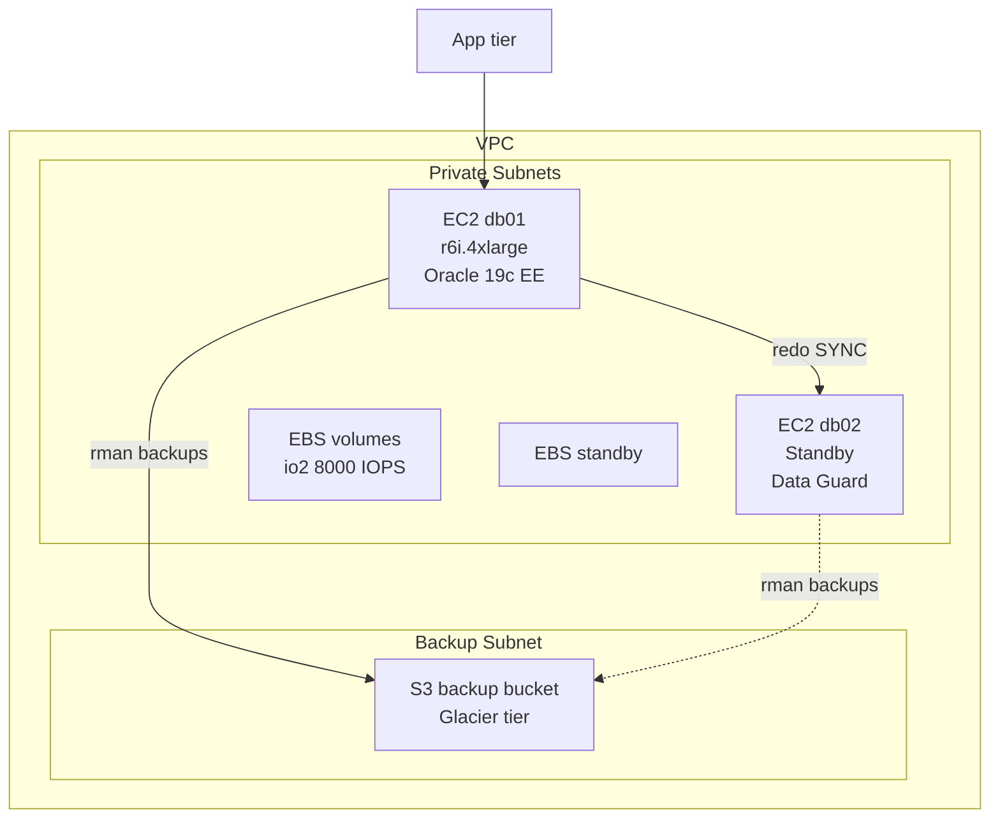

# Oracle on AWS EC2 — Overview

## Model

Run Oracle Database on a plain EC2 instance you own end-to-end. **BYOL** (bring your own license). Same DBA experience as on-prem.

## When It Fits

- You need full control (custom OS, kernel params, third-party tools).
- You need features RDS doesn't support (Data Guard active/active, GoldenGate, Advanced Compression Options, Database Vault).
- You have EE license entitlements to reuse.
- Storage-heavy DBs where NVMe SSD / io2 latency matters.

## When It Doesn't

- Managed patching / backup automation is worth $$ to you → RDS.
- You want elastic autoscaling → RDS or Aurora Postgres.
- Small team without Oracle skills → RDS or Autonomous DB.

## Reference Architecture

## Sizing Rule of Thumb

| Workload    | EC2 family                    | EBS                                     |
| ----------- | ----------------------------- | --------------------------------------- |
| OLTP small  | `r6i.2xlarge` / `m6i.2xlarge` | `gp3` for `/u01`, `io2` 5–10k IOPS data |
| OLTP medium | `r6i.4xlarge` (16 vCPU)       | `io2` 10–20k IOPS                       |
| OLTP large  | `r6in.8xlarge`+               | `io2` 20–64k IOPS, striped              |
| DW / batch  | `r6i.8xlarge`+ high memory    | `gp3` or `io2` large volume             |

- **Memory-optimized `r6i`** better than compute-optimized for Oracle.
- **AWS Nitro** helps consistency.
- Use **placement groups** for RAC (`cluster` placement).

## Networking

- **VPC + private subnets**.
- **Security groups** — only DB port (1521, 1523 for standby) between app + DB.
- **NLB** or **Route 53** for SCAN-style routing if RAC.
- **VPC endpoints** to S3 for backups — avoids public routing.

## OS

- **Oracle Linux 8** (matches Oracle's supported version).
- **UEK** or Red Hat kernel — Oracle supports both.
- Disable Transparent HugePages, enable HugePages.

## Licensing

- **BYOL**: bring your Oracle EE / SE2 license, count vCPUs per Oracle's core-factor.
- **AWS core factor** = 1.0 for Nitro instances (2019+).
- Oracle counts **all vCPUs of the instance** unless license-limited.

## RAC on EC2

Not officially supported by Oracle. Community setups use FSx for NetApp ONTAP or 3rd-party shared storage — but Oracle Support may push back on issues. If you need RAC in cloud, use OCI ExaCS.

## Data Guard on EC2

Fully supported. Standard setup:

- Primary in AZ-A, standby in AZ-B.
- **SYNC** between AZs — added ~2 ms latency, acceptable.
- **ASYNC** if crossing regions.

## Sub-pages

| Page                                      | Purpose            |
| ----------------------------------------- | ------------------ |
| [Filesystem Layout](filesystem-layout.md) | EBS + FS decisions |
| [Backup Strategy](backup-strategy.md)     | RMAN + S3          |

## Related

- [AWS RDS Overview](../aws-rds/overview.md) — the managed alternative.
- [Data Guard](../../17-data-guard/index.md).
