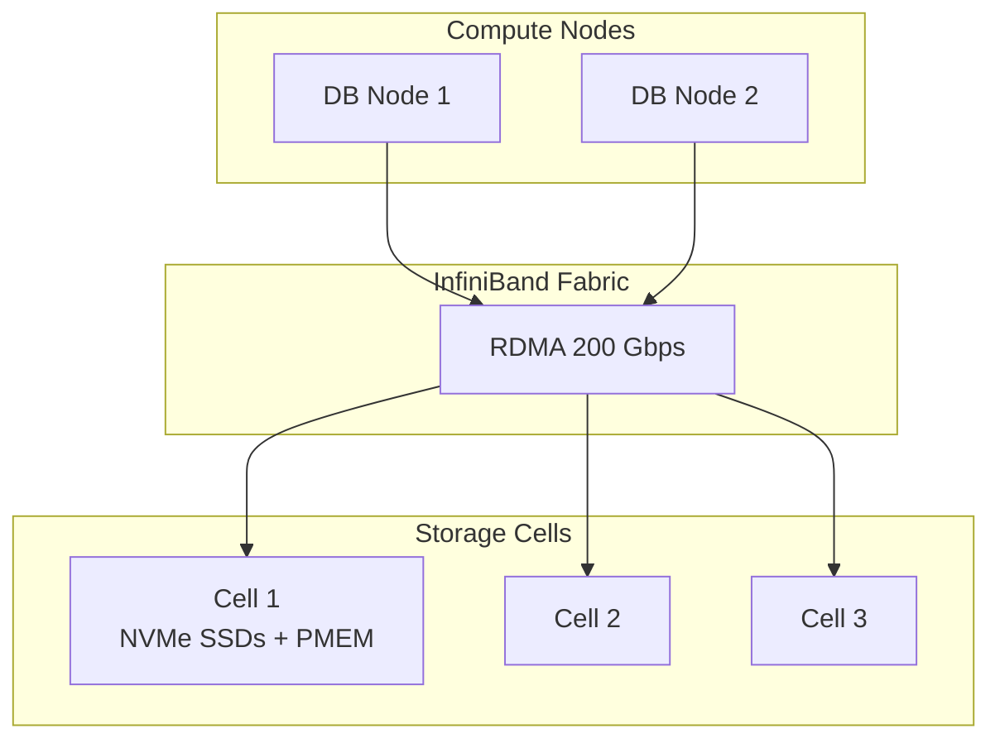

# Exadata Cloud — Overview

## Model

Exadata Cloud Service (ExaCS) puts a real Exadata rack in Oracle Cloud. You get the same **compute nodes**, **RDMA-connected storage cells**, and **InfiniBand fabric** as on-prem X10M Exadata, with Oracle-managed hardware, OS, and Exadata software layers.

Available as:

- **Exadata Cloud Service (ExaCS)** — On OCI.
- **Exadata Cloud@Customer (ExaC@C)** — In your own data center, Oracle-managed.

## Shapes

Sized by "Quarter", "Half", "Full", "Exadata X10M" etc.:

| Shape        | DB Nodes | Cells | vCPUs / node | Storage        |
| ------------ | -------- | ----- | ------------ | -------------- |
| Base X10M    | 2        | 3     | 32           | ~192 TB usable |
| Quarter X10M | 2        | 3     | 96           | ~192 TB usable |
| Half X10M    | 4        | 6     | 96 each      | ~384 TB usable |
| Full X10M    | 8        | 12    | 96 each      | ~768 TB usable |

## Why Exadata

Features not in commodity DB:

- **Smart Scan** — SQL predicates evaluated in storage cell.
- **Storage Indexes** — automatic bloom-filter-like data skipping.
- **Hybrid Columnar Compression (HCC)** — 10–50× compression.
- **Smart Flash Cache** — NVMe transparent cache.
- **RDMA** — sub-µs interconnect.
- **Cell offload** for RMAN backups.

Real workloads see 5–100× speedups on DW / mixed workloads vs commodity.

## Cluster Model

Real RAC on Exadata. Every DB is CDB with PDBs, always. Data Guard between racks is standard.

## Storage Layout

- Cells present **Cell Disks** and **Grid Disks** to compute.
- Grid Disks used as ASM disks — DGs `DATAC1`, `RECOC1`.
- Redundancy at ASM level (HIGH is the norm on ExaCS).

## What Oracle Manages

- HW replacement.
- Storage cell OS + Exadata software.
- Compute node OS.
- Grid Infrastructure.

## What You Manage

- Database (single-instance or CDB).
- Schemas, users, backups (if you don't use managed backup).
- Init parameters.
- Tuning.

## Sub-pages

| Page                                        | Purpose             |
| ------------------------------------------- | ------------------- |
| [Storage Cells](storage-cells.md)           | Cell architecture   |
| [Celldisk / Griddisk](celldisk-griddisk.md) | Cell storage layout |
| [Smart Scan](smart-scan.md)                 | The killer feature  |
| [Monitoring](monitoring.md)                 | ExaCLI / MS         |

## When to Choose Exadata Cloud

- Multi-TB OLTP or DW where commodity IO is a bottleneck.
- HCC compression required.
- Need Smart Scan.
- Consolidation of many databases.

## When Not

- Small workloads (< 1 TB, low IOPS).
- Cost-sensitive; ExaCS starts at ~$20k/month.
- Not comfortable with OCI.

## Related

- [ASM](../../19-asm/index.md).
- [RAC](../../18-rac/index.md).
