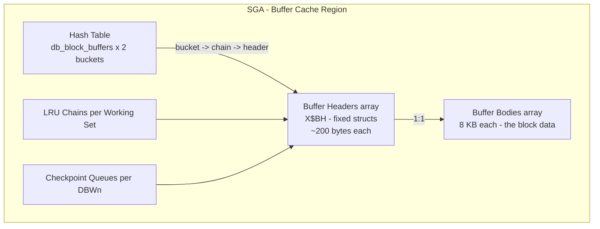
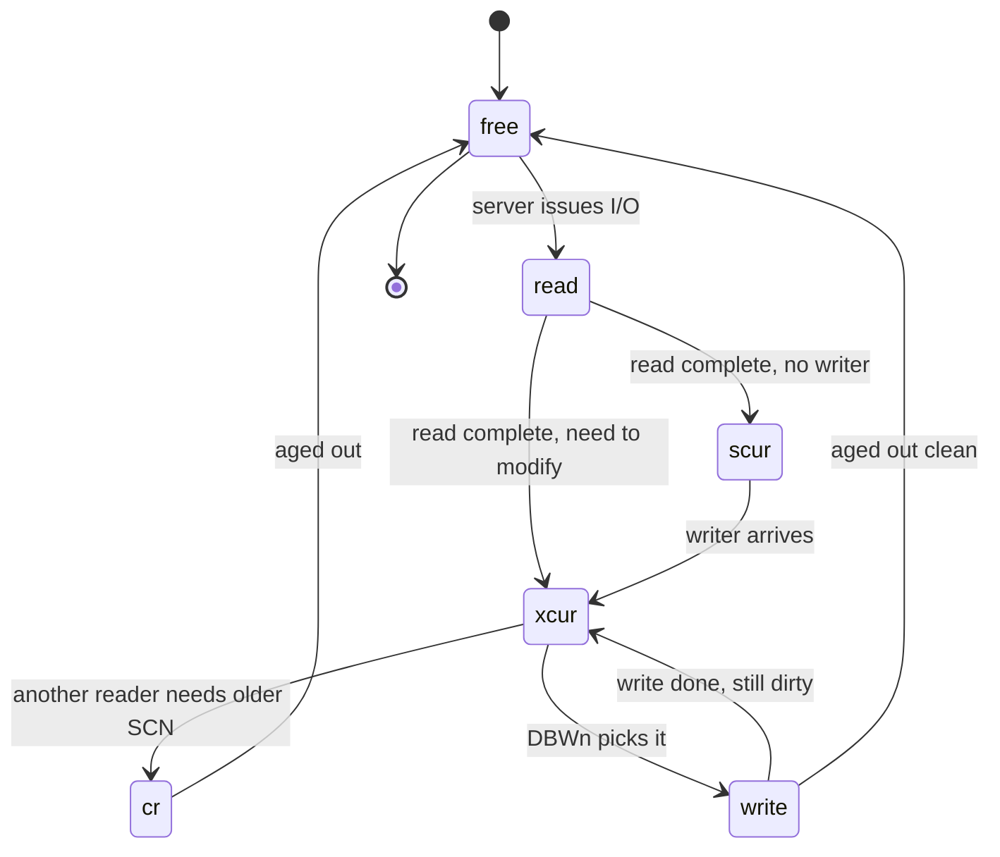

# Buffer Cache Internals

## Overview

The database buffer cache is a fixed-size shared memory pool of **8 KB (default) buffers**, each capable of holding one Oracle data block. Physically it's a big array of buffer bodies indexed by header structs; logically it's a hash table (for lookup) overlaid with LRU chains (for eviction) and per-DBWn write queues (for flushing). Understanding its precise structure is the difference between guessing and diagnosing `cache buffers chains`, `buffer busy waits`, `read by other session`, `free buffer waits`, and delayed block cleanout.

This page covers the actual in-memory layout: buffer headers (`X$BH`), hash chains, working sets, checkpoint queues, touch counts, buffer states, pin mechanics, CR clones, and direct-path reads.

## The Physical Layout



Each buffer has **two lives**:

1. A **body** — 8 KB of block data (the DBA-addressed block).
2. A **header** (`X$BH` row) — metadata: DBA, class, state, touch count, hash-chain pointers, LRU pointers, checkpoint SCN, transaction hints.

## The Hash Table & CBC Latches

Blocks are located by hashing their **DBA** (Data Block Address — file# + block#). Number of hash buckets ≈ `2 * db_block_buffers`. Each bucket heads a **chain** (linked list of buffer headers with equal hash).

Each chain is protected by a **cache buffer chains (CBC) latch**. Number of CBC latches is set by `_db_block_hash_latches` (auto: prime near `power_of_2(buffers/128)`, capped ~65k). One CBC latch typically protects **many chains** (multiple buckets per latch).

Lookup sequence:

1. Session computes `hash(DBA)` → bucket index.
2. Session acquires the CBC latch that guards that bucket (exclusive — walkers hold X mode).
3. Walk the chain looking for a header with matching DBA + class.
4. If found: pin the buffer (see below), release CBC latch.
5. If not found: release CBC latch, initiate disk read (`db file sequential read` or `db file scattered read`), later re-acquire CBC latch to link the newly-loaded buffer into the chain.

**Why CBC latch contention = hot block**: If many sessions are accessing the same DBA at once, they all hash to the same bucket → same latch → contention. `latch: cache buffers chains` wait event with the same `P1RAW` (latch address) across many sessions is the signature.

```sql
-- Find the specific latch address most contended
SELECT   addr, name, gets, misses, sleeps, immediate_gets, immediate_misses
FROM     v$latch_children
WHERE    name = 'cache buffers chains'
   AND   sleeps > 0
ORDER BY sleeps DESC
FETCH FIRST 20 ROWS ONLY;

-- Then find which buffer headers hash under that latch
-- (X$BH.HLADDR = hash latch address)
SELECT   b.file#, b.dbablk, b.class, b.state, b.tch,
         o.owner, o.object_name
FROM     x$bh b LEFT JOIN dba_objects o
              ON o.data_object_id = b.obj
WHERE    b.hladdr = HEXTORAW('&addr')
ORDER BY b.tch DESC
FETCH FIRST 20 ROWS ONLY;
```

## Buffer Header (`X$BH`) — Key Columns

| Column                    | Meaning                                                                                                     |
| ------------------------- | ----------------------------------------------------------------------------------------------------------- |
| `DBABLK`                  | Block# within the file.                                                                                     |
| `FILE#`                   | Relative file#.                                                                                             |
| `CLASS`                   | Buffer class — data (1), sort (2), save undo (3), segment header (4), undo header (5), undo block (6), etc. |
| `STATE`                   | 0=free, 1=xcur, 2=scur, 3=cr, 4=read, 5=mrec, 6=irec, 7=write.                                              |
| `OBJ`                     | data_object_id of the owner (join `DBA_OBJECTS.DATA_OBJECT_ID`).                                            |
| `TCH`                     | Touch count.                                                                                                |
| `TIM`                     | Timestamp of last touch increment.                                                                          |
| `HLADDR`                  | CBC latch address protecting this buffer's chain.                                                           |
| `NXT_HASH` / `PRV_HASH`   | Hash chain pointers.                                                                                        |
| `NXT_REPL` / `PRV_REPL`   | LRU replacement chain pointers.                                                                             |
| `NXT_WRITE` / `PRV_WRITE` | LRUW (dirty write) queue pointers.                                                                          |
| `LRU_FLAG`                | LRU status flags.                                                                                           |
| `FLAG`                    | General state flags (dirty, pinned, being read).                                                            |
| `US_NXT` / `US_PRV`       | Users linked list (who holds this buffer).                                                                  |
| `WA_NXT` / `WA_PRV`       | Waiters list (who is waiting on this buffer).                                                               |
| `LE_ADDR`                 | RAC: pointer to global-cache resource (`GV$GC_ELEMENT`).                                                    |

State transitions:



## Working Sets & DBWn

Each **DBWn** owns exactly one working set. A working set is a slice of the buffer cache with its own:

- **LRU (main replacement) chain** — clean and dirty buffers ordered by touch count.
- **LRUW (write) chain** — dirty buffers queued for write.
- **Auxiliary LRU** — for recycled buffers just written.

Number of working sets = `_db_writer_processes` (usually `CEIL(CPU_COUNT/8)`, min 1). Setting `DB_WRITER_PROCESSES=4` gives 4 working sets — cuts working-set latch contention by ~4×.

Each working set has its own:

- **`cache buffers lru chain` latch** (for LRU manipulation).
- **`checkpoint queue` latch** (for CKPT signaling).

```sql
SELECT   name, gets, misses, sleeps
FROM     v$latch
WHERE    name LIKE 'cache buffers lru chain'
   OR    name LIKE 'checkpoint queue latch'
ORDER BY sleeps DESC;
```

## Touch Count Algorithm (LRU-K style)

Oracle does **not** use strict LRU. It uses **touch counts** with time-based promotion.

Rules (simplified — driven by `_db_aging_touch_time`, `_db_aging_hot_criteria`, `_db_percent_hot_default`):

1. A newly-loaded buffer is placed at the **midpoint of the LRU** (not the head), touch_count = 1.
2. Every subsequent hit increments `TCH`, but at most **once per 3 seconds** (`_db_aging_touch_time`) — prevents inflating counts on hot spins.
3. On eviction pressure, the search starts at the **cold end**. Buffers with `TCH < _db_aging_hot_criteria` (default 2) are candidates.
4. When a candidate is found and reused, the previous holder is bumped further cold if `TCH >= 2`.

Net effect:

- Single-touch reads (big scans) drift to the cold end and get evicted first.
- Repeatedly-touched OLTP blocks stay near the hot end.
- No "wipe-out" from a single large query.

Verify with `X$BH.TCH`:

```sql
-- Distribution of touch counts (histogram)
SELECT   CASE WHEN tch = 0 THEN '00'
              WHEN tch = 1 THEN '01'
              WHEN tch BETWEEN 2 AND 5 THEN '02-05'
              WHEN tch BETWEEN 6 AND 20 THEN '06-20'
              WHEN tch BETWEEN 21 AND 100 THEN '21-100'
              ELSE 'HOT' END bucket,
         COUNT(*) bufs
FROM     x$bh
GROUP BY CASE WHEN tch = 0 THEN '00' WHEN tch = 1 THEN '01'
              WHEN tch BETWEEN 2 AND 5 THEN '02-05'
              WHEN tch BETWEEN 6 AND 20 THEN '06-20'
              WHEN tch BETWEEN 21 AND 100 THEN '21-100'
              ELSE 'HOT' END
ORDER BY 1;
```

Healthy OLTP: bulk of hot buffers with `TCH > 5`. If most buffers show `TCH=1`, either the cache is under-sized or workload does lots of scanning.

## Pin, Get, Unpin

Sessions don't just "read" a buffer — they **pin** it. Two pin modes:

- **Share pin** (S) — for read. Many sessions can hold S concurrently.
- **Exclusive pin** (X) — for modify (DML), or building a CR clone.

Sequence for a logical read:

1. Latch CBC chain (X).
2. Locate buffer header.
3. Increment pin count. If someone holds X and you want X, or vice versa → wait as `buffer busy waits` with `P3 = reason class`.
4. Release CBC latch.
5. Read/modify body.
6. Decrement pin count (unpin).

`buffer busy waits` `P3` reason classes:

| P3      | Meaning                                              |
| ------- | ---------------------------------------------------- |
| 100–199 | Segment header contention (freelist / bitmap block). |
| 200–299 | Data block — another session pinned X.               |
| 300–399 | Undo header.                                         |
| 400–499 | Undo block.                                          |
| Others  | See `V$EVENT_HISTOGRAM` decode table.                |

Same wait event, but the fix differs radically by class. Segment header contention wants ASSM + higher `INITRANS`; data block wants app-level de-hotspotting.

## Consistent Read (CR) Blocks

When session S1 queries a block whose current version has been modified beyond S1's query SCN, Oracle **clones** the buffer:

1. X-pin the current buffer.
2. Allocate a new buffer body from the working set.
3. Copy the current image into it.
4. Roll back changes using undo (from ITL entries) to bring block's SCN ≤ query SCN.
5. Mark the clone `STATE='cr'` (state=3).
6. Unpin current, pin clone S.
7. Return rows to session.

CR clones live in the cache — evicted like any buffer via LRU. `X$BH.STATE=3` visible.

```sql
SELECT COUNT(*) crs FROM x$bh WHERE state = 3;
```

Excessive CR construction → `consistent gets - examination` (`V$SYSSTAT`) grows fast; correlates with `latch: cache buffers chains` (each clone re-latches chain).

## Delayed Block Cleanout

When a big transaction commits, Oracle records the commit SCN in the ITL of a few blocks it recently touched — not all of them (would be too much redo). For the remaining blocks, ITL entries still say "TX in progress".

Later, a reader touches such a block. It:

1. Reads the ITL — sees uncommitted TX.
2. Looks up the TX table (in undo header) — finds the TX already committed.
3. Fetches the commit SCN.
4. Updates the block's ITL with the commit SCN — this is **cleanout**.
5. Generates a small redo record (yes, SELECT can generate redo!).
6. Marks the buffer dirty.

Consequences:

- SELECT after a big INSERT/UPDATE generates redo (surprising).
- Can trigger `db block changes`, `redo entries` growth from read-only workload.
- On standby, delayed cleanout redo is applied normally.

Verify:

```sql
SELECT name, value FROM v$sysstat
WHERE  name IN ('cleanouts only - consistent read gets',
                'cleanouts and rollbacks - consistent read gets',
                'commit cleanouts',
                'commit cleanouts successfully completed');
```

To force cleanout after a big load:

```sql
-- Full-scan the segment so all blocks get read + cleanout
SELECT /*+ FULL(t) */ COUNT(*) FROM app.big_table t;
```

## Free Buffer Scan & `free buffer waits`

Server needs to load a block; no free buffer. It walks the LRU cold-end scanning for a **clean, unpinned** buffer. If it can't find one after `_db_block_max_scan_pct` (default 40%), it posts DBWn to write dirty buffers and waits with `free buffer waits`.

Signature:

- `free buffer waits` climbing → dirty-buffer flush not keeping up.
- Fixes: bigger buffer cache, more DBWn, faster storage, reduce DML burst.

```sql
SELECT event, total_waits, ROUND(time_waited/100,1) secs
FROM   v$system_event
WHERE  event IN ('free buffer waits','write complete waits');
```

## Full-Scan Behavior — Cache vs Direct Path

Two thresholds decide:

- `_small_table_threshold` — usually 2% of buffer cache (in blocks). Below this: buffered read (via cache).
- **Adaptive Direct Read** logic (`_serial_direct_read`) — for larger tables, decides per-scan whether to direct-path read.

Direct-path read:

- Bypasses buffer cache entirely.
- Reads directly into PGA.
- Bumps `physical reads direct` (`V$SYSSTAT`).
- Wait event: `direct path read` (not `db file scattered read`).
- Requires prior **segment-level checkpoint** — flush dirty buffers of that segment first. On busy tables can pause LGWR/DBWn.

Force / disable:

```sql
ALTER SESSION SET "_serial_direct_read" = ALWAYS;   -- force on
ALTER SESSION SET "_serial_direct_read" = NEVER;    -- disable
ALTER SESSION SET "_serial_direct_read" = AUTO;     -- default
```

## `read by other session`

Session A has issued a physical read for block B; session B wants the same block. B waits `read by other session` until A's read completes. Not a bug — expected under any concurrent scan. Excess `read by other session` = cache too small (many concurrent misses) or serial reader problem (no PX).

## Buffer Pool Placement — KEEP / RECYCLE

Advanced (rarely used in 19c because ASMM handles it well):

```sql
ALTER TABLE tiny_hot   STORAGE (BUFFER_POOL KEEP);
ALTER TABLE big_scan   STORAGE (BUFFER_POOL RECYCLE);
```

- **KEEP** — `DB_KEEP_CACHE_SIZE`. Small pool sized to hold entire hot small table. Never evicted by big scans hitting DEFAULT.
- **RECYCLE** — `DB_RECYCLE_CACHE_SIZE`. Small pool for transient blocks; evicted fast.
- **DEFAULT** — the main pool.

Sizing math for KEEP: `size >= sum of blocks * 1.2` (headroom for growth + CR).

## Non-Default Block Sizes

Different tablespaces can have different block sizes (8k, 16k, 32k). Each needs its own pool:

```sql
ALTER SYSTEM SET db_16k_cache_size = 2G SCOPE=BOTH;
```

`DB_CACHE_SIZE` sizes only the default block-size pool.

## RAC — PCM & Buffer Locking

In RAC, every buffer is protected by a **PCM (Parallel Cache Management) resource**. `V$BH.LOCK_ELEMENT_ADDR` points to the GCS resource. Modes:

- **N** (Null) — no rights.
- **S** (Shared) — can read.
- **X** (Exclusive) — can modify.

Cache Fusion ships blocks over the interconnect based on these modes. Wait events: `gc cr block 2-way`, `gc current grant busy`, `gc buffer busy release`.

```sql
SELECT dba, class, mode_held, mode_requested, blocking_others
FROM   gv$gc_element
WHERE  blocking_others = 'YES';
```

See [Cache Fusion Internals](cache-fusion-internals.md).

## Buffer Cache Advisory

`V$DB_CACHE_ADVICE` simulates hit-ratio at various buffer cache sizes based on last hour of workload:

```sql
SELECT   size_for_estimate, size_factor,
         buffers_for_estimate, estd_physical_read_factor,
         estd_physical_reads
FROM     v$db_cache_advice
WHERE    name = 'DEFAULT' AND advice_status = 'ON' AND block_size = 8192
ORDER BY size_for_estimate;
```

`estd_physical_read_factor` = 1.0 at current size. If a bigger size shows 0.5, doubling cache cuts physical reads in half.

## Diagnostic Recipes

### Find the hottest block

```sql
SELECT   b.file#, b.dbablk, b.class,
         COUNT(*) copies, MAX(b.tch) max_tch,
         o.owner, o.object_name
FROM     x$bh b LEFT JOIN dba_objects o ON o.data_object_id = b.obj
WHERE    b.tch > 20
GROUP BY b.file#, b.dbablk, b.class, o.owner, o.object_name
ORDER BY MAX(b.tch) DESC
FETCH FIRST 20 ROWS ONLY;
```

### Buffer state distribution

```sql
SELECT DECODE(state,0,'free',1,'xcur',2,'scur',3,'cr',4,'read',5,'mrec',6,'irec',7,'write') s,
       COUNT(*) bufs
FROM   x$bh
GROUP  BY DECODE(state,0,'free',1,'xcur',2,'scur',3,'cr',4,'read',5,'mrec',6,'irec',7,'write');
```

### Objects with highest cache footprint

```sql
SELECT   NVL(o.object_name,'UNKNOWN') object_name, o.object_type,
         COUNT(*) blocks_in_cache,
         ROUND(COUNT(*)*8192/1024/1024,2) mb
FROM     x$bh b LEFT JOIN dba_objects o ON o.data_object_id = b.obj
GROUP BY o.object_name, o.object_type
ORDER BY 3 DESC
FETCH FIRST 20 ROWS ONLY;
```

### Segments generating most CR clones

```sql
SELECT   o.object_name, COUNT(*) cr_clones
FROM     x$bh b JOIN dba_objects o ON o.data_object_id = b.obj
WHERE    b.state = 3
GROUP BY o.object_name
ORDER BY 2 DESC
FETCH FIRST 20 ROWS ONLY;
```

## Related

- [Buffer Cache (basic)](../03-instance-architecture/memory/buffer-cache.md).
- [SGA](../03-instance-architecture/memory/sga.md).
- [DBWn](../25-reference/background-processes/dbwn.md).
- [Latches vs Mutexes](latches-vs-mutexes.md).
- [Block Format & ITL](block-format-itl.md).
- [Undo & CR Internals](undo-cr-internals.md).
- [Cache Fusion Internals](cache-fusion-internals.md).
