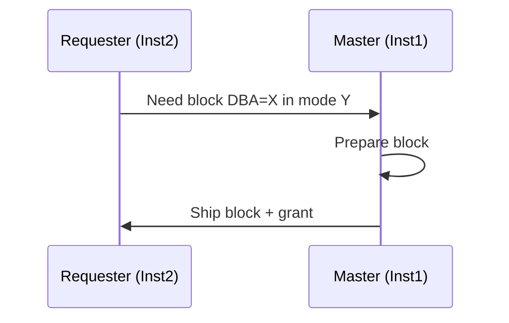

# Cache Fusion Internals

## Overview

**Cache Fusion** is the mechanism that lets multiple RAC instances share a coherent buffer cache view of the database. When instance B needs a block that instance A already has cached — dirty or clean — it doesn't read from disk. It fetches the block over the private interconnect via **LMS** (Global Cache Service processes). Cache Fusion is what makes RAC a coherent-cache cluster instead of a coordinated-lock cluster.

This page walks the resource model, block modes, transfer paths, LMS behavior, and diagnostic paths for `gc *` wait events.

## Global Resource Model

Every block in the buffer cache of any instance is protected by a **GCS resource** — a distributed lock managed by **GES** (Global Enqueue Service) plus **GCS** (Global Cache Service). Ownership metadata is partitioned across instances:

- Each block's DBA hashes to a **master instance**.
- Master maintains the block's global state — which instances have S/X copies, current owner.
- All ownership queries and grants go through the master.

Modes per instance per block:

- **N** (Null) — no rights. Baseline state after eviction.
- **S** (Shared) — read-only copy.
- **X** (Exclusive) — modification rights (only one instance at a time).

Compatible matrix:

| Held \ Requested | N   | S   | X   |
| ---------------- | --- | --- | --- |
| N                | OK  | OK  | OK  |
| S                | OK  | OK  | NO  |
| X                | OK  | NO  | NO  |

X-held blocks are called **PI (Past Image)** blocks after transfer — see below.

## The GCS/GES Processes

Per instance:

- **`LMON`** — Global Enqueue Service Monitor. Reconfiguration on join/leave.
- **`LMD`** — Global Enqueue Service Daemon. Serves enqueue requests (non-cache resources: DDL, TX enqueues, RC).
- **`LMSn`** — Global Cache Service. Ships blocks and handles block-mode changes. Multiple (`GCS_SERVER_PROCESSES`).
- **`LCK0`** — Local coordination for library cache, row cache, and buffer cache global-resource caching.

LMS's job:

1. Receive block request from remote instance.
2. Look up buffer in local cache.
3. If dirty & remote wants X → prepare CR/current, ship, transition local to N or S.
4. If clean & remote wants S → ship, keep local S.
5. Update global resource state via master.

Throughput of LMS ≈ CPU speed × interconnect bandwidth. Under high traffic, `LMSn` becomes the bottleneck.

## Transfer Paths

### 2-Way — Requester ↔ Holder

Simplest case. Requester (Inst2) asks for block. Master (Inst1) is also the holder.



Wait event: `gc cr block 2-way` (for CR read) or `gc current block 2-way` (for current read).

Typical latency: 1–3 ms on 10 GbE interconnect, sub-ms on Exadata RDMA.

### 3-Way — Requester → Master → Holder

Requester (Inst3) asks. Master (Inst1) knows Inst2 has the block. Master forwards.

```mermaid
sequenceDiagram
    participant R as Requester (Inst3)
    participant M as Master (Inst1)
    participant H as Holder (Inst2)

    R->>M: Need block DBA=X
    M->>H: Forward request; instruct to ship
    H->>R: Ship block
    H->>M: Ack + updated state
```

Wait event: `gc cr block 3-way` or `gc current block 3-way`.

Latency: 2–5 ms typical.

### Disk Read

Master says "no instance has it" or holder can't ship (busy). Requester reads from disk.

Wait event: `gc cr grant 2-way` (permission granted, read from disk) or classic `db file sequential read` after.

## PI (Past Image) Blocks

When Inst1 X-holds a dirty block and Inst2 asks for the current copy:

1. Inst1 ships the current image.
2. Inst2 becomes X-holder.
3. Inst1 keeps a **Past Image (PI)** — a still-dirty copy of the pre-transfer state.

Why keep PI? For recovery. If Inst2 crashes before writing the block, GCS can rebuild the current state from Inst1's PI + Inst2's redo. Without PI, recovery would need to fetch from disk + apply all redo.

PIs stored in `X$BH` with `STATE=8` (past image). Consume buffer cache space.

## Common `gc` Wait Events

| Event                       | Meaning                                                      |
| --------------------------- | ------------------------------------------------------------ |
| `gc cr block 2-way`         | Read CR image from master/holder in 1 hop.                   |
| `gc cr block 3-way`         | Read CR image with forward.                                  |
| `gc current block 2-way`    | Read current image, 1 hop.                                   |
| `gc current block 3-way`    | Read current image, forwarded.                               |
| `gc current block busy`     | Holder busy modifying the block; ship delayed.               |
| `gc buffer busy acquire`    | Waiting for a local buffer during global operation.          |
| `gc buffer busy release`    | Same, other flavor; often on hot blocks.                     |
| `gc cr grant 2-way`         | Permission granted; block not in any cache — read from disk. |
| `gc cr multi block request` | Batched request (used by scans).                             |
| `gc remaster`               | Master moving from one instance to another.                  |
| `gc bg acquire lock`        | Background process acquiring GCS lock.                       |

## Typical Latencies (10 GbE Interconnect)

- 2-way: 1–3 ms
- 3-way: 2–5 ms
- Anything > 10 ms = interconnect or LMS issue.

Interconnect diagnosis:

```bash
oifcfg getif
ifconfig <priv_interface>
ethtool <priv_interface>
netstat -s | grep -iE 'retrans|drop|error'
```

## `gc buffer busy release` — Hot Block

The nastiest cache fusion symptom. Sequence:

1. Session on Inst1 pins block X to modify.
2. Sessions on Inst2 want same block; they wait.
3. Inst1 finishes; block transitions.
4. Inst2 sessions serially fetch — each waits on the previous.

Root cause: **application hot block** — sequence audit block, index leaf, order-of-insert PK.

Common triggers:

- Sequence with `ORDER` on RAC (forces coordination on every nextval).
- INSERTs with sequential PK → all target same index leaf.
- Small hot table.

Fixes:

- `ALTER SEQUENCE seq NOORDER CACHE 10000`.
- Hash-partition the hot table.
- Reverse-key index for sequential-PK inserts (trade for range scans).
- Application-level distribution.

## `gc current block busy` — Concurrent DML

Session on Inst1 has X on the block, mid-DML. Session on Inst2 wants current image. Waits until Inst1 completes.

Fix: reduce cross-instance concurrent DML. Application affinity (services on preferred instances). Partitioning.

## GCS Message Statistics

```sql
SELECT   name, value FROM v$sysstat
WHERE    name IN ('gc cr blocks received', 'gc cr blocks served',
                  'gc current blocks received', 'gc current blocks served',
                  'gc cr block receive time', 'gc current block receive time',
                  'gc cr block build time', 'gc current block pin time',
                  'gc cr blocks flushed to disk', 'gc current blocks flushed to disk')
ORDER BY name;
```

Average receive time:

```sql
SELECT (SELECT value FROM v$sysstat WHERE name = 'gc cr block receive time') /
       (SELECT value FROM v$sysstat WHERE name = 'gc cr blocks received') * 10 avg_ms
FROM   dual;
```

Should be < 5 ms.

## LMS Backlog

If `LMSn` can't keep up:

```sql
-- LMS session waits
SELECT s.sid, s.event, s.wait_class, s.seconds_in_wait,
       p.pname
FROM   v$session s JOIN v$process p ON p.addr = s.paddr
WHERE  p.pname LIKE 'LMS%';
```

Should almost always be idle. If sustained non-idle, tune:

- `GCS_SERVER_PROCESSES` — add LMS processes (default: `min(2, CPU_COUNT/8)`).
- Interconnect capacity.

## Global Cache Element (`GV$GC_ELEMENT`)

Per-resource metadata:

```sql
SELECT   inst_id, indx, class,
         gc_element_flags, gc_element_addr,
         current_owner, current_owner_role,
         current_owner_role_incarnation,
         DECODE(mode_held, 0,'N', 1,'S', 2,'X') mode_held,
         DECODE(mode_requested, 0,'N', 1,'S', 2,'X') mode_requested,
         blocking_others
FROM     gv$gc_element
WHERE    blocking_others = 'YES'
FETCH FIRST 20 ROWS ONLY;
```

`blocking_others = YES` = this resource is causing waits somewhere. Investigate the underlying block.

## Resource Master Distribution

Blocks are hashed to masters. On instance join/leave, remastering redistributes resources — expensive.

`gc remastering` events indicate active reconfiguration. `V$HVMASTER_INFO`:

```sql
SELECT   inst_id, hv_id, current_master, previous_master,
         remaster_cnt
FROM     gv$hvmaster_info;
```

## Dynamic Remastering

Oracle can remaster an entire object to a specific instance if that instance dominates access:

```sql
SELECT * FROM v$dynamic_remaster_stats;
SELECT * FROM v$hvmaster_info WHERE remaster_cnt > 0;
```

Rare in modern default configs; can be forced:

```sql
EXEC DBMS_HA.REMASTER_ALL('APP.ORDERS', TARGET_INSTANCE_ID => 2);
```

## Fusion vs Ping

Historically (Oracle 8), block transfer required writing to disk (**ping**), reading back on the other instance. Extremely slow. Cache Fusion (9i+) eliminated ping by shipping over interconnect.

You still see `gc cr blocks flushed to disk` occasionally — happens when checkpointing forces flush before ship, or when the LMS decides disk-round-trip is cheaper (rare).

## Fastest Cache Fusion — Exadata RDMA

Exadata + RoCE / IB uses **RDMA** — LMS bypasses TCP stack, writes directly into remote instance's memory. Latency < 100 µs. `gc *` waits become nearly free.

## Diagnostic Recipe

```sql
-- Global cache time contribution to DB time
SELECT   event, ROUND(time_waited/100,1) secs,
         ROUND(time_waited*100/SUM(time_waited) OVER (), 2) pct_of_total
FROM     gv$system_event
WHERE    event LIKE 'gc %' AND wait_class NOT IN ('Idle')
ORDER BY time_waited DESC;

-- Blocks worth of GC traffic
SELECT   inst_id, name, value FROM gv$sysstat
WHERE    name LIKE 'gc %block%received'
ORDER BY value DESC;

-- Top objects by GC waits (ASH-based)
SELECT   current_obj#,
         COUNT(*) samples
FROM     gv$active_session_history
WHERE    sample_time > SYSDATE - 15/1440
   AND   event LIKE 'gc %'
   AND   current_obj# > 0
GROUP BY current_obj#
ORDER BY 2 DESC
FETCH FIRST 20 ROWS ONLY;
```

Join `current_obj#` to `dba_objects.data_object_id` for the name.

## Interview Framing

> "What is Cache Fusion?"

RAC's block-sharing mechanism. Blocks needed by one instance and cached by another are shipped over the private interconnect (via LMS) rather than round-tripped via disk. Preserves single-cache semantics across N instances.

> "What is a 3-way `gc` wait?"

The requesting instance asks the master; master forwards to the holder; holder ships. Three network hops (request → forward → data). Normal in RAC when master ≠ holder.

> "Interpret `gc buffer busy release`."

Hot block. Multiple instances wanting concurrent access to the same block. Root cause is usually application-level: sequence with ORDER, sequential-PK inserts, or hot small table. Fix at app design, not by tuning GC.

## Related

- [RAC](../18-rac/index.md).
- [Cache Fusion](../18-rac/cache-fusion.md).
- [GCS](../18-rac/gcs.md), [GES](../18-rac/ges.md).
- [Buffer Cache Internals](buffer-cache-internals.md).
- [Wait Event Framework](wait-event-framework.md).
- [Evictions](../18-rac/evictions.md).
