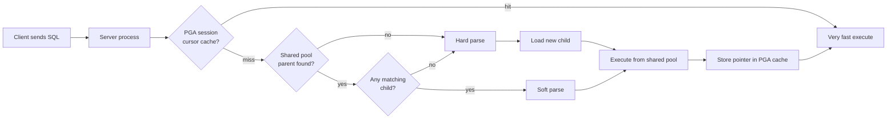

# Cursor Internals

## Overview

A cursor is the runtime materialization of a SQL statement — its text, its parsed representation, its plan, its bind data, and its execution state. Oracle's cursor architecture is a two-level cache (parent + child) sitting inside a **three-tier lookup pipeline**: session-cached cursor → shared-pool child → hard-parse-and-load. Every wait event with "cursor", "parse", or "library cache" in its name is a symptom of movement between these tiers.

This page maps the full cursor state machine, the parent/child memory layout, the lookup pipeline, PGA-side caching, and the mechanics of `V$SQL_SHARED_CURSOR` reasons for non-sharing.

## Parent and Child Cursors

- **Parent cursor** — one per SQL text (after normalization). Identified by `SQL_ID` (a base-32 encoded hash of the text). Contains SQL text, hash values, and a **child list**.
- **Child cursor** — one per parent per compilation environment. Contains the parsed representation (`heap 0`, `heap 6`), the execution plan, bind metadata, and a link back to parent.

A single `SQL_ID` can have multiple children when compilation environment differs:

- Different bind types / lengths (`BIND_MISMATCH`).
- Different `optimizer_mode`, `optimizer_features_enable`, session-level hints (`OPTIMIZER_MISMATCH`).
- Different `NLS_*` (`LANGUAGE_MISMATCH`).
- Adaptive Cursor Sharing spawned bind-aware children (`USE_FEEDBACK_STATS`, `BIND_EQUIV_FAILURE`).
- Rolling invalidation window emitted a new child (`ROLL_INVALID_MISMATCH`).
- Container context (`PDB_PLUG_IN_VIOLATIONS`, `CONTAINER_MISMATCH`).

## The Lookup Pipeline



Costs, roughly:

| Tier                       | CPU per exec   | Latch/mutex work                      |
| -------------------------- | -------------- | ------------------------------------- |
| PGA-cached soft-soft parse | ~2 µs          | None (PGA-local)                      |
| Shared-pool soft parse     | ~10–20 µs      | `library cache: mutex S` × 2          |
| Hard parse                 | 500 µs – 50 ms | `latch: shared pool` + optimizer work |

The 25,000× cost gap between hard parse and PGA-cached is why **bind variables** and `SESSION_CACHED_CURSORS` matter.

## Hard Parse — What Actually Happens

1. **Syntax check** — grammar / tokens valid.
2. **Semantic check** — objects exist, privileges present, columns resolve.
3. **Cursor lookup on shared pool** — hash the text, walk KGL bucket for the SQL AREA namespace object. If found, jump to soft parse.
4. **Optimizer** —
   - Transform the SQL (view merging, predicate pushdown, subquery unnesting, star transform, join elimination).
   - Enumerate access paths per table, join orders, join methods.
   - Compute cost per combination using object stats + histograms.
   - Pick lowest-cost plan (or, if adaptive, plan + adaptive decision).
5. **Code generation** — build the row-source tree (`ROW SOURCE` operators).
6. **Store child cursor** in shared pool — needs shared-pool memory allocation → `latch: shared pool`.
7. **Register dependencies** — every object referenced becomes a dependency, so DDL on that object invalidates this cursor.

The **10053 CBO trace** is a dump of steps 4–5. Enormous but shows every cost decision.

## Soft Parse — Fast Path

1. Compute `SQL_TEXT` hash.
2. Under the KGL bucket mutex, find the parent (`SQL AREA` namespace object).
3. Walk the child list checking `V$SQL_SHARED_CURSOR`-style mismatch flags.
4. Found match — pin the child.
5. Rebind the placeholders.
6. Execute.

Cost dominated by the KGL mutex on the parent.

## PGA-Held Cursor — Fastest

Set at session level:

```sql
ALTER SESSION SET session_cached_cursors = 500;
```

Or system-wide:

```sql
ALTER SYSTEM SET session_cached_cursors = 200 SCOPE=SPFILE;
```

Semantics:

- After N executions of the same cursor, Oracle stores a pointer to the child in the session's PGA cursor cache.
- Subsequent executes skip the shared-pool lookup entirely.
- Cursor stays in shared pool while any session holds a PGA reference.

Verify:

```sql
SELECT   name, value FROM v$mystat s JOIN v$statname n ON s.statistic# = n.statistic#
WHERE    name IN ('parse count (total)',
                  'parse count (hard)',
                  'parse count (soft)',
                  'session cursor cache count',
                  'session cursor cache hits');
```

Ratio `session cursor cache hits / parse count (total)` should exceed 0.9 in bind-heavy OLTP.

## Cursor Sharing Modes

`CURSOR_SHARING` — the master switch:

- `EXACT` (default) — texts must match byte-for-byte. Bind variables required for sharing.
- `FORCE` — Oracle rewrites literal values to system-generated binds (`SYS_B_0`, `SYS_B_1`, ...) before matching. Behaves like binds even if app uses literals.
- `SIMILAR` — deprecated (was FORCE but with per-plan bind sensitivity). Do not use.

`FORCE` side effects:

- Every literal treated as bind → optimizer loses selectivity info from literals → may pick worse plans.
- Fixes shared-pool pressure but at cost of potential plan quality.
- Rule: never `FORCE` globally; use for a specific runaway app while devs fix binds.

## Detecting Non-Sharing (`V$SQL_SHARED_CURSOR`)

Every child cursor has a row in `V$SQL_SHARED_CURSOR` with ~70 Y/N columns explaining why it was created vs the earlier sibling:

```sql
SELECT sql_id, child_number,
       CASE WHEN unbound_cursor = 'Y' THEN 'UNBOUND' END,
       CASE WHEN sql_type_mismatch = 'Y' THEN 'SQL_TYPE' END,
       CASE WHEN optimizer_mismatch = 'Y' THEN 'OPTIMIZER' END,
       CASE WHEN outline_mismatch = 'Y' THEN 'OUTLINE' END,
       CASE WHEN stats_row_mismatch = 'Y' THEN 'STATS_ROW' END,
       CASE WHEN literal_mismatch = 'Y' THEN 'LITERAL' END,
       CASE WHEN sec_depth_mismatch = 'Y' THEN 'SEC_DEPTH' END,
       CASE WHEN explain_plan_cursor = 'Y' THEN 'EXPLAIN' END,
       CASE WHEN buffered_dml_mismatch = 'Y' THEN 'BUFFERED_DML' END,
       CASE WHEN pdml_env_mismatch = 'Y' THEN 'PDML_ENV' END,
       CASE WHEN inst_drtld_mismatch = 'Y' THEN 'INST_DRTLD' END,
       CASE WHEN slave_qc_mismatch = 'Y' THEN 'SLAVE_QC' END,
       CASE WHEN typecheck_mismatch = 'Y' THEN 'TYPECHECK' END,
       CASE WHEN auth_check_mismatch = 'Y' THEN 'AUTH_CHECK' END,
       CASE WHEN bind_mismatch = 'Y' THEN 'BIND' END,
       CASE WHEN describe_mismatch = 'Y' THEN 'DESCRIBE' END,
       CASE WHEN language_mismatch = 'Y' THEN 'LANGUAGE' END,
       CASE WHEN translation_mismatch = 'Y' THEN 'TRANSLATION' END,
       CASE WHEN bind_equiv_failure = 'Y' THEN 'BIND_EQUIV' END,
       CASE WHEN insuff_privs = 'Y' THEN 'PRIVS' END,
       CASE WHEN role_mismatch = 'Y' THEN 'ROLE' END,
       CASE WHEN load_optimizer_stats = 'Y' THEN 'LOAD_STATS' END,
       CASE WHEN acl_mismatch = 'Y' THEN 'ACL' END,
       CASE WHEN flashback_cursor = 'Y' THEN 'FLASHBACK' END,
       CASE WHEN anydata_transformation = 'Y' THEN 'ANYDATA' END,
       CASE WHEN pddl_env_mismatch = 'Y' THEN 'PDDL_ENV' END,
       CASE WHEN top_level_rpi_cursor = 'Y' THEN 'RPI' END,
       CASE WHEN different_long_length = 'Y' THEN 'LONG_LENGTH' END,
       CASE WHEN logical_standby_apply = 'Y' THEN 'LOG_STANDBY' END,
       CASE WHEN diff_txn_isolation_level = 'Y' THEN 'TX_ISOLATION' END,
       CASE WHEN roll_invalid_mismatch = 'Y' THEN 'ROLL_INVALID' END,
       CASE WHEN mv_query_gen_mismatch = 'Y' THEN 'MV_GEN' END,
       CASE WHEN user_bind_peek_mismatch = 'Y' THEN 'BIND_PEEK' END,
       CASE WHEN cross_container = 'Y' THEN 'CROSS_CONTAINER' END,
       CASE WHEN use_feedback_stats = 'Y' THEN 'CARDINALITY_FBK' END
FROM   v$sql_shared_cursor
WHERE  sql_id = '&sql_id'
ORDER  BY child_number;
```

Interpretation:

- `USE_FEEDBACK_STATS = Y` — cardinality feedback (statistics feedback) split. Common source of noise.
- `ROLL_INVALID_MISMATCH = Y` — `DBMS_STATS` gathered with `NO_INVALIDATE=DBMS_STATS.AUTO_INVALIDATE` rolled the cursor.
- `BIND_MISMATCH = Y` — bind type / length differs.
- `USER_BIND_PEEK_MISMATCH = Y` — ACS bind-aware split.

## Adaptive Cursor Sharing — Deeper

Beyond the summary in [SQL Tuning → ACS](../36-sql-tuning/adaptive-cursor-sharing.md), the internal state machine:

1. On hard parse of a bind-variable SQL with **column histograms**, Oracle marks the child `IS_BIND_SENSITIVE=Y`.
2. Every execution updates `V$SQL_CS_STATISTICS` with actual rows returned.
3. If observed rows differ significantly from optimizer estimate for the peeked bind, Oracle promotes to `IS_BIND_AWARE=Y`.
4. On next execute with a bind whose predicted selectivity falls outside existing children's ranges, a new child is created — with a plan optimized for that range.
5. `V$SQL_CS_SELECTIVITY` records the (low, high, plan) mapping per child.

```sql
-- What ACS knows about a SQL
SELECT sql_id, child_number, is_bind_sensitive, is_bind_aware, is_shareable
FROM   v$sql
WHERE  sql_id = '&sql_id';

SELECT sql_id, child_number, executions_delta, buffer_gets_delta, rows_processed_delta
FROM   v$sql_cs_statistics
WHERE  sql_id = '&sql_id';

SELECT sql_id, child_number, low, high, predicate,
       ROUND(low, 4) sel_low, ROUND(high, 4) sel_high
FROM   v$sql_cs_selectivity
WHERE  sql_id = '&sql_id';

SELECT sql_id, child_number, bucket_id, count
FROM   v$sql_cs_histogram
WHERE  sql_id = '&sql_id'
ORDER  BY child_number, bucket_id;
```

## Cursor Rolling Invalidation

`DBMS_STATS.GATHER_TABLE_STATS(..., no_invalidate=>DBMS_STATS.AUTO_INVALIDATE)` (the default) doesn't hard-invalidate cursors instantly. Instead:

1. Marks affected cursors "rolled invalid" with a random `INVALIDATION_WINDOW` (from `_optimizer_invalidation_period`, default 18000 s = 5 h).
2. First execution after the window's expiry triggers reparse.

Purpose: avoid a parse storm right after a mass stats gather.

Downside: for the next 5 hours, executions of the same SQL may randomly hit new plans as different sessions cross their window. That's `ROLL_INVALID_MISMATCH` — a new child cursor per rolled session.

Force immediate invalidation:

```sql
EXEC DBMS_STATS.GATHER_TABLE_STATS('APP','ORDERS', no_invalidate=>FALSE);
```

## Cursor Obsolescence

When shared pool pressure or many child cursors accumulate, Oracle marks children **obsolete**:

```sql
SELECT sql_id, child_number, is_obsolete
FROM   v$sql
WHERE  is_obsolete = 'Y';
```

Once obsolete, cursor becomes unshareable — next parse creates a new parent. This resets the child chain, breaking pathological accumulation.

Cursor obsolescence threshold: `_cursor_obsolete_threshold` (default 1024 in 12.2, 8192 in 19c). When a parent has more than that many children, mark parent obsolete.

## Cursor Pin States

Every time a session executes a cached cursor:

- **`cursor pin S` (share)** — allow other sessions to execute concurrently.
- **`cursor pin X` (exclusive)** — only during compilation / linking, not during regular execute.

Mutex-based since 11g:

- `cursor: pin S wait on X` — waiting for someone else to release X (usually a concurrent hard parse).
- `cursor: mutex X` — waiting for X (structural changes).

## Marking Hot for Copies

Extreme hot cursor causes mutex contention even with binds. Two mitigations:

1. **`DBMS_SHARED_POOL.MARKHOT`** (18c+) — mark specific cursor as "hot":

   ```sql
   BEGIN
     DBMS_SHARED_POOL.MARKHOT(hash => &full_hash_value, namespace => 0);
   END;
   /
   ```

   Oracle creates multiple copies of the cursor. Sessions hash to different copies → less mutex contention.

2. **`_kgl_hot_object_copies`** — enable automatic hot-object copying globally (MOS-guided). Copies are created for objects with mutex contention exceeding threshold.

Confirm hot marking:

```sql
SELECT hash_value, namespace, num_copies
FROM   dba_hot_objects;
```

## PL/SQL Cursor Cache

Beyond `SESSION_CACHED_CURSORS`, PL/SQL implicit cursor cache: OCI/native drivers cache open cursors per session. Each SQL inside PL/SQL is opened, used, and — if `plsql_optimize_level >= 2` — automatically stays open across executions.

`OPEN_CURSORS` limits the total open cursors per session (not to be confused with `SESSION_CACHED_CURSORS`, which caches pointers). Rule of thumb: `OPEN_CURSORS >= SESSION_CACHED_CURSORS + 100`.

## Diagnostic Queries

### Cursors of a specific SQL_ID

```sql
SELECT   child_number, plan_hash_value, executions, parse_calls,
         loads, invalidations, is_shareable, is_obsolete,
         is_bind_sensitive, is_bind_aware,
         first_load_time, last_active_time
FROM     v$sql
WHERE    sql_id = '&sql_id'
ORDER BY child_number;
```

### Parent SQL statements with many children (proliferation)

```sql
SELECT sql_id, COUNT(*) children, MAX(loads) max_loads,
       MAX(invalidations) max_invalidations
FROM   v$sql
GROUP  BY sql_id
HAVING COUNT(*) > 10
ORDER  BY 2 DESC
FETCH  FIRST 20 ROWS ONLY;
```

### Non-bind detection (literal SQL that could be binds)

```sql
SELECT   substr(sql_text,1,60) prefix, COUNT(*) copies,
         SUM(executions) execs
FROM     v$sqlarea
WHERE    executions > 0
GROUP BY substr(sql_text,1,60)
HAVING   COUNT(*) > 30
ORDER BY 2 DESC
FETCH FIRST 10 ROWS ONLY;
```

### Parse stats profile of this session

```sql
SELECT   name, value FROM v$mystat s JOIN v$statname n ON s.statistic# = n.statistic#
WHERE    name IN ('parse count (total)',
                  'parse count (hard)',
                  'parse count (soft)',
                  'parse count (describe)',
                  'parse time cpu',
                  'parse time elapsed',
                  'session cursor cache count',
                  'session cursor cache hits',
                  'session cursor cache count max',
                  'opened cursors current',
                  'opened cursors cumulative');
```

Ideal: `parse count (hard) / parse count (total)` < 0.01, `session cursor cache hits / parse count (total)` > 0.9.

### Cursor sharing decisions in progress

```sql
SELECT s.sid, s.serial#, s.event, s.p1, s.p2, s.sql_id,
       cs.reason, cs.child_number
FROM   v$session s
LEFT JOIN v$sql_shared_cursor cs ON cs.sql_id = s.sql_id
WHERE  s.event IN ('cursor: pin S wait on X','cursor: mutex X','library cache: mutex X');
```

## Related

- [Library Cache](library-cache.md).
- [KGH & Shared Pool Heap](kgh-shared-pool-heap.md).
- [Latches vs Mutexes](latches-vs-mutexes.md).
- [Bind Peeking](../36-sql-tuning/bind-peeking.md).
- [Adaptive Cursor Sharing](../36-sql-tuning/adaptive-cursor-sharing.md).
- [Latch Contention](../12-performance-tuning/latch-contention.md).
- [Mutex Contention](../12-performance-tuning/mutex-contention.md).
