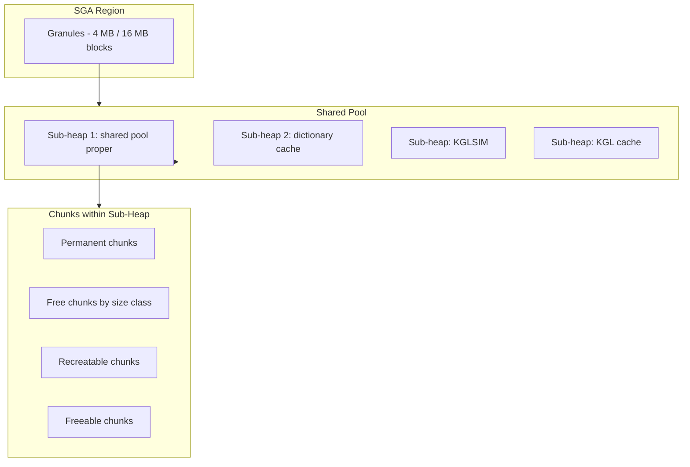

# KGH — Shared Pool Heap Manager

## Overview

**KGH** (Kernel Generic Heap) is Oracle's shared-pool memory allocator — the layer between "give me 4 KB for a cursor plan" and the underlying granule of SGA memory. It manages **sub-heaps**, **chunks**, **free lists by size class**, and **LRU eviction** when memory is tight. Every ORA-04031 traceback names KGH sub-heaps ("`sga heap(1,0)`", "`kglsim heap`") — you can't diagnose without understanding this layer.

## Heap Hierarchy



## Sub-Heaps

The shared pool is subdivided into **sub-heaps** — sometimes one, sometimes many. On big-SGA / ASMM setups, `_kghdsidx_count` sets the sub-heap count for the main shared pool. Default: min(CPU_COUNT, 7) for big SGAs.

Each sub-heap has:

- Its own set of free lists (size-class bins).
- Its own LRU list of recreatable chunks.
- Its own protecting latch (`shared pool` latch — per sub-heap).

Multiple sub-heaps = less latch contention on hard parses.

```sql
SELECT * FROM v$sgastat WHERE pool = 'shared pool' AND name LIKE '%(1,0)%';
-- Sub-heap (1,0) is the main one.
```

## Chunk Types

Every allocation from shared pool becomes a **chunk** with a type:

| Type          | Freed by       | Contents                                             |
| ------------- | -------------- | ---------------------------------------------------- |
| `permanent`   | Never          | SGA fixed structures.                                |
| `free`        | Available      | Waiting to be allocated.                             |
| `recreatable` | LRU age-out    | Cursors, PL/SQL bodies, KGL bodies, dictionary rows. |
| `freeable`    | Owner releases | Transient allocations.                               |

**Recreatable** = if freed, Oracle can reload the object from dictionary. This is what LRU aging targets when pressure builds.

**Permanent** = pinned forever; grows only. If shared pool has too many permanent chunks, less room for recreatable → contention.

Query chunks:

```sql
SELECT   ksmchcls chunk_class, COUNT(*) chunks,
         ROUND(SUM(ksmchsiz)/1024/1024, 2) mb
FROM     x$ksmsp
GROUP BY ksmchcls
ORDER BY 3 DESC;
```

## Size-Class Free Lists

KGH maintains **free lists by size class** — buckets of free chunks by size. Allocation looks up the smallest bucket ≥ requested size, unlinks a chunk, and returns it. Fast path: O(1) if bucket has a chunk.

When no exact-size chunk exists:

1. Try larger bucket → split.
2. If no larger → LRU-evict a recreatable → free it → retry.
3. If still fails after evictions → `ORA-04031`.

## Reserved Pool

`SHARED_POOL_RESERVED_SIZE` carves out a portion of shared pool for **large allocations** (default: allocations ≥ `_shared_pool_reserved_min_alloc`, default 4400 bytes). Small allocations can't touch this region — protects against small-chunk exhaustion crowding out big.

Under pressure:

- Regular pool exhausted → try reserved pool.
- If reserved also exhausted → ORA-04031 with pool="shared pool" and sub-heap="`(1,0)`".

Tuning:

```sql
SHOW PARAMETER shared_pool_reserved_size

-- V$SHARED_POOL_RESERVED
SELECT * FROM v$shared_pool_reserved;
```

Key columns:

- `FREE_SPACE` — available in reserved.
- `AVG_FREE_SIZE` — avg chunk size.
- `FREE_COUNT` — count of free chunks.
- `MAX_FREE_SIZE` — largest chunk.
- `REQUEST_FAILURES` — ORA-04031 in reserved pool.
- `LAST_MISS_SIZE` — size of last failed request.

Recommended `SHARED_POOL_RESERVED_SIZE` = 5–10% of shared pool.

## LRU Aging

Recreatable chunks are on an LRU list. When new allocation triggers eviction:

1. Walk LRU from cold end.
2. For each chunk, check if it can be freed (not pinned).
3. Free chunk → returns to size-class bucket.
4. Repeat until enough contiguous space, or list exhausted.

**Fragmentation** hazard: many small free chunks, no contiguous large chunk. Even with lots of "free memory" showing, a 4 KB request can fail. Aggressive small-allocation workload (non-bind literals SQL) causes this.

## The ORA-04031 Trace File

When ORA-04031 fires, Oracle writes a trace with:

- **Requested size**: 4 KB (or whatever).
- **Sub-heap**: `sga heap(1,0)`.
- **Category**: usually `KGLH0` (KGL Heap 0 — cursor body).
- **Free memory in sub-heap**: total + largest chunk.
- **HEAPDUMP** — chunk-by-chunk dump of sub-heap.

Read pattern:

```
Total permanent memory: 128 MB
Total non-permanent memory: 3072 MB
Free chunks: 45892 chunks, 890 MB
Largest free chunk: 3.5 KB    <-- KEY: no chunk large enough
Reserved pool: exhausted
```

Diagnose: fragmentation. Fix: bind variables, reserved pool sizing, or `ALTER SYSTEM FLUSH SHARED_POOL` as emergency.

## Chunk Metadata (`X$KSMSP`)

```sql
SELECT   ksmchcls chunk_class, ksmchcom description,
         ROUND(ksmchsiz, 0) size_bytes, COUNT(*) chunks,
         ROUND(SUM(ksmchsiz)/1024/1024, 2) total_mb
FROM     x$ksmsp
WHERE    ksmchcom IS NOT NULL
GROUP BY ksmchcls, ksmchcom, ROUND(ksmchsiz, 0)
HAVING   COUNT(*) > 100
ORDER BY total_mb DESC
FETCH FIRST 30 ROWS ONLY;
```

`KSMCHCOM` — the "comment" field describing what's in the chunk:

- `SQLA` — SQL Area (cursor).
- `KGLHD` — KGL Handle.
- `KGLH0` — KGL Heap 0.
- `KGLDA` — KGL data.
- `KGLHDBOX` — KGL handle bulk.
- `PL/SQL DIANA` — PL/SQL parse tree.
- `PL/SQL MPCODE` — PL/SQL machine code.
- `permanent memory` — permanent structures.

Excess of any one class signals a specific problem — too many `SQLA` = literal SQL not sharing.

## Diagnostic Queries

### Shared pool overall

```sql
SELECT   name, ROUND(bytes/1024/1024, 2) mb
FROM     v$sgastat
WHERE    pool = 'shared pool'
ORDER BY bytes DESC
FETCH FIRST 30 ROWS ONLY;
```

### Free memory fragmentation profile

```sql
SELECT   ROUND(ksmchsiz, 0) chunk_size,
         COUNT(*) chunks,
         ROUND(SUM(ksmchsiz)/1024/1024, 2) mb
FROM     x$ksmsp
WHERE    ksmchcls = 'free'
GROUP BY ROUND(ksmchsiz, 0)
ORDER BY chunk_size;
```

### Sub-heap allocation summary

```sql
SELECT   sh.kghlusd sub_heap, sh.kghlutsz total_size,
         sh.kghlufsz free_size,
         sh.kghlurcr recreatable, sh.kghlutrn transient
FROM     x$kghlu sh;
```

## Sizing Advice

| Setting                            | Rule of thumb                                        |
| ---------------------------------- | ---------------------------------------------------- |
| `SHARED_POOL_SIZE`                 | ≥ 25% of SGA_TARGET; more if many cursors.           |
| `SHARED_POOL_RESERVED_SIZE`        | 5–10% of SHARED_POOL_SIZE.                           |
| `_shared_pool_reserved_min_alloc`  | 4400 bytes default; increase for cursor-heavy loads. |
| Sub-heap count (`_kghdsidx_count`) | auto; touch only per MOS SR.                         |

## Mitigations Under Pressure

1. **`ALTER SYSTEM FLUSH SHARED_POOL`** — nuclear option. Frees all recreatable. Causes parse storm.
2. **`DBMS_SHARED_POOL.PURGE`** — targeted cursor purge.
3. **`DBMS_SHARED_POOL.KEEP`** — pin object (e.g., critical package) to prevent aging. Use for stable, hot PL/SQL packages:
   ```sql
   EXEC DBMS_SHARED_POOL.KEEP('APP.PKG_ORDERS','P');
   ```
4. **Bind variables** — attacks root cause.
5. **Grow SHARED_POOL_SIZE** — ASMM handles automatically; set floor to prevent shrink.
6. **CURSOR_SHARING=FORCE** — bandaid, per-app scope only.

## Sub-Heap "Sizes"

`X$KGHLU` shows sub-heap usage. Typical sub-heaps in 19c:

- `(1,0)` — shared pool proper.
- `(1,3)` — reserved sub-heap.
- `(1,3800000000)` and similar — result cache, kglsim.
- Multiple `SGA heap` entries when `_kghdsidx_count > 1`.

## Fragmentation vs Genuine Exhaustion

Distinguish:

- **Genuine**: `V$SGASTAT.free memory` for shared pool < 1% → grow pool.
- **Fragmentation**: `free memory` > 10% but largest chunk small → adjust reserved pool / bind variables.

## Interview Framing

> "You see ORA-04031 with `KGLH0` in the trace. What is it and what do you do?"

`KGLH0` = KGL Heap 0 — the primary sub-heap for cursor bodies. ORA-04031 there means shared pool can't allocate a chunk for a new cursor body. Root causes: shared pool too small, fragmentation from literal SQL, or a specific hot cursor allocation pattern. Fix path: `V$SQLAREA` for SQL with high `SHARABLE_MEM`, bind variable audit, size up shared pool floor, ensure reserved pool sized appropriately.

## Related

- [Library Cache](library-cache.md).
- [Cursor Internals](cursor-internals.md).
- [Shared Pool](../03-instance-architecture/memory/shared-pool.md).
- [ORA-04031](../26-errors/ora-04031.md).
- [SGA](../03-instance-architecture/memory/sga.md).
