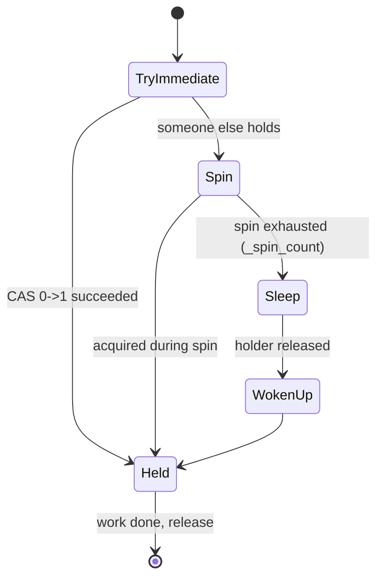
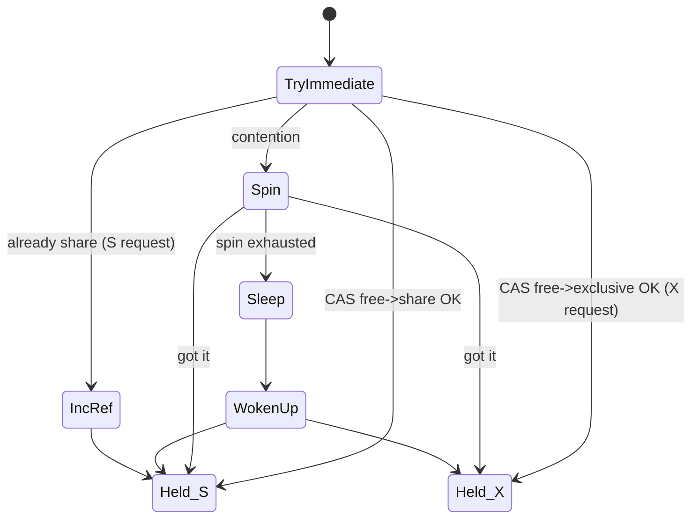

# Latches vs Mutexes

## Overview

Latches and mutexes are Oracle's **fast serialization primitives** — used to protect in-memory structures whose critical sections last ~microseconds. Both spin, both sleep, both incur wait events under contention. But they differ in concurrency model, granularity, memory footprint, and cost of a single get. This page walks the internals: get/release state machines, spin-then-sleep behavior, level ordering for deadlock prevention, and diagnostic paths.

## Latch — Internals

A **latch** is a small kernel structure (~80 bytes) with:

- **Address** — its identity, exposed as `V$LATCH_CHILDREN.ADDR`.
- **State** — 0 (free) or 1 (held). Manipulated by atomic compare-and-swap.
- **Level** — an integer used for ordering (see below).
- **Class** — 0–7 (`_latch_class_0` through `_latch_class_7`), controls spin behavior.
- **Holder** — SPID of the process currently holding it.
- **Wait list** — sessions sleeping on this latch.
- **Statistics** — gets, misses, sleeps, wait time (`V$LATCH`).

Latch acquisition state machine:



`_spin_count` — default 2000. In the spin loop, the process retries the CAS this many times before sleeping.

Why spin: latches are held for << 1 µs. Sleeping costs ~1–5 µs of context switch. Spinning is cheaper if holder releases fast.

## Willing-to-Wait vs Immediate Latches

Two acquisition modes:

- **Willing-to-wait** — spin, then sleep. Used for latches that must be acquired eventually. `V$LATCH.MISSES` counts spin exhaustions; `SLEEPS` counts sleeps.
- **Immediate** — try once; if failed, don't retry. Used when the caller has a backup plan. `V$LATCH.IMMEDIATE_MISSES` counts failures.

Example — CBC latch is willing-to-wait (must read the block). LRU chain latch has both — DBWn tries immediate on multiple working sets.

## Latch Levels — Deadlock Prevention

Every latch has a **level** (0–13 typically). A process holding latch at level N may **only** acquire latches at level > N. Attempting to acquire lower-level latch while holding higher-level = fatal error (Oracle deadlock signature, prevented by design).

Query levels:

```sql
SELECT DISTINCT name, level# FROM v$latch ORDER BY level#, name;
```

Common levels:

- 0 — `Consistent RBA`, `session allocation`.
- 1 — `redo copy`, `cache buffers lru chain`.
- 2 — `cache buffers chains`.
- 3 — `library cache`, `shared pool`.
- 4 — `enqueue hash chains`.
- 5 — `library cache load lock`.
- 7 — `sequence cache`.

Level enforcement means you can hold shared pool latch (3) and then acquire enqueue latch (4), but not the reverse.

## Latch Classes

`_latch_class_0` through `_latch_class_7` control spin behavior:

- `_latch_class_0` (default) — `spin_count=2000`, `wait_time=0` (yield to CPU on sleep).
- Higher classes have different spin/wait tuning.

Individual latches assigned to a class via `_latch_classes`. Rare to modify.

## Latch Get — Code Path

Simplified:

```c
int latch_get(latch_t *l, int level, int mode) {
    // Level check
    if (holding_latch_at_or_below(level)) panic();

    int spins = _spin_count;

    while (spins-- > 0) {
        if (CAS(l->state, 0, 1)) {   // atomic compare-and-swap
            l->holder = my_pid;
            increment(l->gets);
            return SUCCESS;
        }
        increment(l->misses);
        // Consume CPU cycles — no yield
    }

    // Spin exhausted — sleep
    add_to_wait_list(l, self);
    increment(l->sleeps);
    start_wait_event("latch: " || l->name);
    sleep();
    end_wait_event();

    return latch_get(l, level, mode);   // retry
}
```

Every `MISS` is one spin attempt failed. Every `SLEEP` is one sleep. `V$LATCH.WAIT_TIME` accumulates sleep duration.

## Mutex — Internals

A **mutex** in Oracle is a reference-counted shared/exclusive primitive:

- **Value word** (~4 bytes) — encodes `mode` (S/X) and `reference_count`.
- **Owner** — the SID of the holder (for X mode).
- **Wait list** — sessions waiting for X on this mutex.

Mutex value encoding (schematic):

```
Bits 0-1:   mode (0=free, 1=share, 2=exclusive, 3=transitioning)
Bits 2-31:  reference count for share mode
```

Modes:

- **Free** — no holders.
- **Share (S)** — many readers; each increments refcount.
- **Exclusive (X)** — single writer; blocks new S/X requests.

Acquisition:



Where mutex wins over latch:

- **Share mode** — N sessions can hold simultaneously without serializing. Latch would serialize all N.
- **Finer granularity** — one mutex per KGL object, per cursor, per library cache bucket. Latches are typically one per structure (with child latches).

## Latch vs Mutex Cost

| Operation                 | Latch     | Mutex      |
| ------------------------- | --------- | ---------- |
| Uncontended get           | ~30 ns    | ~30 ns     |
| Contended (spin, succeed) | ~1 µs     | ~1 µs      |
| Contended (sleep, wakeup) | ~10 µs+   | ~10 µs+    |
| Memory footprint          | 80 bytes  | 4–32 bytes |
| Instances of primitive    | thousands | millions   |

## Where Each Is Used (19c)

| Structure                | Primitive               | Notes                                                   |
| ------------------------ | ----------------------- | ------------------------------------------------------- |
| Buffer cache hash chains | Latch (`CBC`)           | Hash-based; latch scales with `_db_block_hash_latches`. |
| Buffer cache LRU chain   | Latch (per working set) | Per DBWn.                                               |
| Shared pool allocation   | Latch                   | Contention on hard parses.                              |
| Library cache lookup     | Mutex (per bucket)      | Was latch pre-11g.                                      |
| Library cache pin        | Mutex                   | Was latch pre-11g.                                      |
| KGL object examine       | Mutex                   | Cursors, packages.                                      |
| Cursor pin (execute)     | Mutex                   | S mode by default.                                      |
| Redo allocation          | Latch (per strand)      | See [Redo Internals](redo-internals.md).                |
| Result cache             | Latch (single)          | Bottleneck under high result_cache use.                 |
| Enqueue hash chains      | Latch                   | Enqueue lookup.                                         |
| GES (RAC)                | Latch                   | Distributed lock manager.                               |
| Row cache                | Latch                   | Data dictionary cache.                                  |

## Latch Diagnostics

```sql
-- Top latches by sleeps
SELECT   name, gets, misses, sleeps, wait_time,
         ROUND(misses/GREATEST(gets,1)*100, 3) miss_pct,
         ROUND(wait_time/GREATEST(sleeps,1), 3) avg_sleep_us
FROM     v$latch
WHERE    sleeps > 0
ORDER BY sleeps DESC
FETCH FIRST 20 ROWS ONLY;

-- Which child of a parent latch
SELECT   child#, gets, misses, sleeps, wait_time
FROM     v$latch_children
WHERE    name = '&latch_name'
   AND   sleeps > 0
ORDER BY sleeps DESC
FETCH FIRST 20 ROWS ONLY;

-- Latch miss context (where in Oracle code)
SELECT   parent_name, "WHERE" src_location,
         nwfail_count immediate_failures,
         sleep_count, wtr_slp_count
FROM     v$latch_misses
WHERE    sleep_count > 0
ORDER BY sleep_count DESC
FETCH FIRST 20 ROWS ONLY;
```

`V$LATCH_MISSES."WHERE"` — the exact C function that failed the latch get. Sample: `kcbgtcr: kslbegin excl`. Search MOS by this string.

## Mutex Diagnostics

```sql
-- Mutex sleeps aggregated
SELECT   mutex_type, location, sleeps,
         ROUND(wait_time/1000000,2) wait_secs
FROM     v$mutex_sleep
ORDER BY sleeps DESC
FETCH FIRST 20 ROWS ONLY;

-- Recent mutex sleep events (per session/cursor)
SELECT   mutex_type, location, sql_id,
         mutex_value, sleeps, sleep_timestamp
FROM     v$mutex_sleep_history
WHERE    sleep_timestamp > SYSDATE - 1/24
ORDER BY sleeps DESC
FETCH FIRST 20 ROWS ONLY;

-- What sessions waiting on mutex right now
SELECT   sid, event, p1raw, p2raw, p3raw, seconds_in_wait
FROM     v$session
WHERE    event LIKE '%mutex%' OR event LIKE 'cursor: pin%';
```

`P1`, `P2`, `P3` on mutex waits:

- `P1` = mutex value.
- `P2` = KGL object address (for library cache mutex) or SQL hash.
- `P3` = mutex operation code (get/release).

Join `P2` to `X$KGLOB.KGLHDADR` to name the contended object.

## Spin Loop Tuning (Rarely)

`_spin_count = 2000` is the default. Increasing it:

- Reduces sleeps (spin longer = more likely to catch holder).
- Increases CPU consumption during contention.
- On many-core boxes, sometimes helps.

Almost always: don't touch. Fix the contention source instead.

## Contention Fix Playbook

| Symptom                       | Root Cause                              | Fix                                                                                   |
| ----------------------------- | --------------------------------------- | ------------------------------------------------------------------------------------- |
| `latch: cache buffers chains` | Hot block                               | Spread rows (hash partitions), sequence NOORDER CACHE, add columns to reduce hotspot. |
| `latch: shared pool`          | Hard parses / non-bind                  | Use bind variables. Grow shared pool.                                                 |
| `latch: redo allocation`      | High commit rate + insufficient strands | Bump `_log_parallelism_max`.                                                          |
| `library cache: mutex X`      | Hot cursor                              | Bind variables; `DBMS_SHARED_POOL.MARKHOT`; `_kgl_hot_object_copies`.                 |
| `cursor: pin S wait on X`     | Concurrent hard parse                   | Bind variables; increase `session_cached_cursors`.                                    |
| `library cache lock`          | DDL during DML                          | Schedule DDL off-hours; `ddl_lock_timeout`.                                           |
| `latch: row cache objects`    | Sequence cache too small                | Bigger `CACHE`.                                                                       |
| `latch: result cache`         | Excessive result_cache                  | `RESULT_CACHE_MODE=MANUAL`; use hints selectively.                                    |

## RAC Considerations

Latches and mutexes are **instance-local** — they protect per-instance memory. RAC coordination uses **enqueues** (via GES) instead. In RAC:

- Local latch contention still exists.
- Additional waits: `gc *` events for cross-instance data.
- Global enqueue mode conflicts: `enq: TX - row lock`, `enq: TM - contention` show up cluster-wide.

## Legacy vs Modern

- **Pre-11g**: everything was latch. Very hot cursors caused epic `library cache pin` waits.
- **11g**: library cache lookup + pin migrated to mutex. `library cache: mutex X/S` waits appeared.
- **12c+**: mutex used more broadly.
- **19c**: cursor pin, KGL examine, KGL bucket lookup all mutex-based.

Buffer cache still latch — hash lookup semantics + very short hold time make latch adequate. Result cache still latch — was designed pre-mutex-era, hasn't been reworked.

## Interview Framing

> "You see `latch: cache buffers chains` waits. What do you do?"

Not "add memory". Answer:

1. Find the specific child latch address from `V$LATCH_CHILDREN`.
2. Query `X$BH` filtered by `HLADDR = <that address>` — get the DBAs on that chain.
3. Join to `DBA_OBJECTS` — identify the object.
4. Investigate why that block is hot (sequence audit, PK-of-order-of-insert, freelist header, etc.).
5. Fix at application/design layer.

> "You see `library cache: mutex X` waits. What do you do?"

1. `V$SESSION.P2RAW` → KGL object address → `X$KGLOB` → the object name.
2. If it's a specific cursor: use binds, then `MARKHOT`.
3. If shared pool sized wrong: grow it.

## Related

- [Buffer Cache Internals](buffer-cache-internals.md).
- [Cursor Internals](cursor-internals.md).
- [Library Cache](library-cache.md).
- [Latch Contention](../12-performance-tuning/latch-contention.md).
- [Mutex Contention](../12-performance-tuning/mutex-contention.md).
- [Concurrency Wait Events](../25-reference/wait-events/concurrency.md).
- [Wait Event Framework](wait-event-framework.md).
