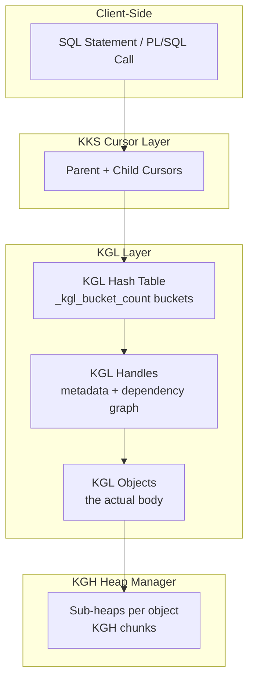

# Library Cache

## Overview

The library cache is the region of the shared pool where Oracle caches parsed forms of **every named database object** — SQL cursors, PL/SQL packages, table/view metadata, sequences, triggers, types, indexes, directories, and more. It's implemented by **KGL** (Kernel Generic Library) — a hash-based generic caching layer with support for hierarchical dependencies, mutex/latch protection, and pluggable object types (called **namespaces**).

Every wait event beginning with `library cache` or `cursor:` and every ORA-04031 sub-heap named `KGL*` is telling you about KGL activity.

## KGL Layered View



Every object in the library cache has:

- **Handle** (`X$KGLOB`) — small (~200 bytes), always present, tracks name, hash, namespace, dependency lists, lock/pin holders, heap descriptors.
- **Object body** — the payload — allocated in one or more **KGH sub-heaps** attached to the handle.

The handle is cheap to keep resident. The body may be aged out; when needed, Oracle **reloads** it from the dictionary (increment `V$LIBRARYCACHE.RELOADS`).

## KGL Namespaces

Objects are partitioned by **namespace**. Namespace choice controls which lookup, which hash, and which dependency semantics.

Selected namespaces:

| ID  | Namespace                 | Contents                                       |
| --- | ------------------------- | ---------------------------------------------- |
| 0   | `CRSR` / `SQL AREA`       | SQL cursors — parents + children.              |
| 1   | `TABL`                    | Tables.                                        |
| 2   | `PRC` / `TABLE/PROCEDURE` | Procedures, functions, packages (spec), types. |
| 3   | `BODY`                    | Package/procedure bodies, type bodies.         |
| 4   | `TRIG`                    | Triggers.                                      |
| 5   | `INDX`                    | Indexes.                                       |
| 6   | `CLU`                     | Clusters.                                      |
| 7   | `TYPE`                    | User-defined types.                            |
| 8   | `TYPB`                    | Type bodies.                                   |
| 9   | `SEQ`                     | Sequences.                                     |
| 10  | `SYN`                     | Synonyms.                                      |
| 11  | `PIPE`                    | DBMS_PIPE named pipes.                         |
| 13  | `LOB`                     | LOB metadata.                                  |
| 14  | `DIR`                     | Directories.                                   |
| 21  | `QUEUE`                   | AQ queues.                                     |
| 47  | `EDITION`                 | Editions (edition-based redefinition).         |
| 74  | `SO_PRIV`                 | System-object privileges caches.               |
| 82  | `RULES`                   | Rule/rule-set definitions.                     |

Total ≈ 100 namespaces in 19c. See `X$KGLNS` for a live list:

```sql
SELECT kglnstyp, kglnsdsc FROM x$kglns ORDER BY kglnstyp;
```

Cursors (namespace 0) are usually the largest population. `V$DB_OBJECT_CACHE` and `V$LIBRARYCACHE` show per-namespace counters.

## Handle Structure

A KGL handle (`X$KGLOB`) — key columns:

| Column                  | Meaning                                        |
| ----------------------- | ---------------------------------------------- |
| `KGLHDADR`              | Handle address (used to join everywhere).      |
| `KGLNAHSH`              | Full 32-bit hash of the object name/text.      |
| `KGLNAOWN`              | Owner.                                         |
| `KGLNAOBJ`              | Object name (or SQL text prefix for cursors).  |
| `KGLNADBID`             | Container DBID.                                |
| `KGLNSNAM`              | Namespace.                                     |
| `KGLOBTYP`              | Object type numeric.                           |
| `KGLOBTYD`              | Object type text.                              |
| `KGLHDLKC`              | Lock count.                                    |
| `KGLHDPMD` / `KGLHDLMD` | Pin/lock mode counts.                          |
| `KGLOBSZ`               | Total heap size across sub-heaps (bytes).      |
| `KGLOBHS0`              | Heap 0 size (main handle heap).                |
| `KGLOBHS6`              | Heap 6 size (child cursor SQL area, for CRSR). |
| `KGLHDIVC`              | Invalidation count.                            |

Query hot handles:

```sql
SELECT   kglnaown, kglnaobj, kglobtyd,
         ROUND(kglobsz/1024,1) kb, kglhdlkc lock_count,
         kglhdivc invalidations
FROM     x$kglob
WHERE    kglnstyp = 0
ORDER BY kglobsz DESC
FETCH FIRST 20 ROWS ONLY;
```

## Locks and Pins — Semantics

Two orthogonal protections:

**KGL Lock** — held for the **duration of the reference**. Modes:

- `N` (Null) — placeholder.
- `S` (Share) — read-only reference.
- `X` (Exclusive) — DDL, structural change.

A parsing session holds an S lock on every object referenced by the SQL. DDL requires X — hence `library cache lock` waits when DDL meets an active cursor.

**KGL Pin** — held during **active manipulation**. Modes: `S` (share), `X` (exclusive).

- Executing a cursor → S pin on the cursor.
- Compiling a PL/SQL body → X pin on the body.

`library cache pin` waits appear when someone else has X while you want S (or vice versa) on the same object.

Since 11g, most cursor pins have migrated to **mutex** implementation for scalability. See [Latches vs Mutexes](latches-vs-mutexes.md).

## `X$KGLLK`, `X$KGLPN` — Who Holds What

```sql
-- Every KGL lock held right now
SELECT   s.sid, s.serial#, s.username,
         lk.kglhdnsp namespace,
         lk.kglnaown owner, lk.kglnaobj object,
         DECODE(lk.kgllkmod, 0,'N',1,'NR',2,'S',3,'X') mode_held,
         DECODE(lk.kgllkreq, 0,'None',1,'NR',2,'S',3,'X') mode_requested,
         DECODE(lk.kgllkctx, 1,'DDL',2,'DML','other') ctx
FROM     x$kgllk lk JOIN v$session s ON s.saddr = lk.kgllkuse
WHERE    lk.kgllkreq > 0    -- waiting
   OR    lk.kgllkmod = 3;   -- exclusive held
```

```sql
-- KGL pins
SELECT   s.sid, s.serial#, s.username,
         pn.kglpnhdl handle_addr,
         DECODE(pn.kglpnmod, 1,'S',2,'X') mode_held,
         DECODE(pn.kglpnreq, 1,'S',2,'X') mode_requested
FROM     x$kglpn pn JOIN v$session s ON s.saddr = pn.kglpnuse
WHERE    pn.kglpnreq > 0
   OR    pn.kglpnmod = 2;
```

## Dependency Graph

Every object records:

- **Dependencies** — objects it references. Each an incoming edge.
- **Dependents** — objects that reference it. Each an outgoing edge.

Stored as adjacency lists in KGL. When a dependency changes (DDL, stats, revoke), Oracle walks the outgoing edges from that node and invalidates every dependent, cascading recursively.

Query dependencies:

```sql
SELECT owner, name, type, referenced_owner, referenced_name, referenced_type
FROM   dba_dependencies
WHERE  owner = 'APP' AND name = 'PKG_ORDERS';
```

For live cursor dependencies (X$):

```sql
SELECT   d.kglhdadr child_handle, o.kglnaobj referenced_obj, o.kglobtyd
FROM     x$kgldp d JOIN x$kglob o ON o.kglhdadr = d.kgldphdl
WHERE    d.kglhdadr = HEXTORAW('&child_cursor_handle');
```

## Invalidations — Rolling vs Immediate

Invalidation modes:

- **Immediate** — object flagged as invalid; cursor evicted; next execute → hard parse.
- **Rolling** — cursor's `INVALIDATION_WINDOW` seeded with random 0..`_optimizer_invalidation_period` (default 5 h). Each session's next execute after its window expires triggers re-parse. Prevents parse storm.

Rolling is used by `DBMS_STATS.GATHER_TABLE_STATS(..., no_invalidate=>DBMS_STATS.AUTO_INVALIDATE)` (default).

```sql
SELECT sql_id, plan_hash_value, executions, invalidations,
       DECODE(SIGN(invalidations - loads), 1, 'REPARSED', 0, 'OK', 'OK') state
FROM   v$sql
WHERE  invalidations > 0
ORDER  BY invalidations DESC
FETCH  FIRST 20 ROWS ONLY;
```

## Loads and Reloads

- **`LOADS`** — count of full loads into shared pool. Includes initial load + reloads.
- **`INVALIDATIONS`** — how many times the cursor was invalidated (subset of loads).
- **`FIRST_LOAD_TIME`** — first appearance in shared pool.
- **Reloads** are counted in `V$LIBRARYCACHE.RELOADS` per namespace.

High reloads with low invalidations = shared pool pressure (evicted → reloaded).

## `V$LIBRARYCACHE` — Per-Namespace Health

```sql
SELECT   namespace, gets, gethits, pins, pinhits,
         reloads, invalidations, dlm_lock_requests
FROM     v$librarycache
ORDER BY gets DESC;
```

- **`gets` / `gethits`** — lookup activity + hit rate.
- **`pins` / `pinhits`** — pin activity + hit rate (execution).
- **`reloads`** — reload count.
- **`invalidations`** — invalidation count.
- **`dlm_lock_requests`** — RAC coordination.

Health check:

```sql
SELECT   SUM(gethits) / SUM(gets) * 100 gethit_pct,
         SUM(pinhits) / SUM(pins) * 100 pinhit_pct,
         SUM(reloads) reloads_total,
         SUM(invalidations) invalidations_total
FROM     v$librarycache;
```

`gethit_pct`, `pinhit_pct` should exceed 99%. Reloads spike often means shared pool too small.

## KGL Mutex vs Latch

Since 11g, several protections migrated from latch to mutex:

| Structure                 | Pre-11g               | 11g+                            |
| ------------------------- | --------------------- | ------------------------------- |
| KGL bucket lookup         | `library cache` latch | mutex (per bucket / per object) |
| KGL object examine        | latch                 | mutex                           |
| KGL pin (share/exclusive) | latch                 | mutex                           |
| Cursor pin                | latch                 | mutex                           |

`library cache: mutex X` waits — typically many concurrent hard parses on the same object:

```sql
SELECT   s.sid, s.event, s.p1raw hash_or_bucket, s.p2raw kgl_object_address,
         o.kglnaobj name, o.kglobtyd type, s.seconds_in_wait
FROM     v$session s LEFT JOIN x$kglob o
              ON o.kglhdadr = s.p2raw
WHERE    s.event LIKE 'library cache: mutex%';
```

## Sizing Effects

Library cache lives inside the shared pool. Under memory pressure:

1. LRU on KGL objects — cold cursors get freed.
2. Bodies freed first; handles retained (small).
3. Continued pressure → handles freed too.
4. Next reference reloads from dictionary — high cost.

Symptoms of undersize:

- `library cache: mutex X` — waits during reload contention.
- `V$LIBRARYCACHE.RELOADS` rising rapidly.
- `V$SGASTAT` shows `free memory` in shared pool → 0 frequently.

Fix: `SHARED_POOL_SIZE` floor high enough (see [Memory Parameters](../25-reference/initialization-parameters/memory-parameters.md)).

## Flushing and Targeted Purging

Full flush (parse storm risk — avoid in prod):

```sql
ALTER SYSTEM FLUSH SHARED_POOL;
```

Targeted purge (`DBMS_SHARED_POOL.PURGE`):

```sql
DECLARE
  addr VARCHAR2(20); hash NUMBER;
BEGIN
  SELECT address, hash_value INTO addr, hash
  FROM   v$sqlarea WHERE sql_id = '&sql_id' AND rownum = 1;

  DBMS_SHARED_POOL.PURGE(addr || ',' || hash, 'C');   -- 'C' = cursor
END;
/
```

Purge by name (PL/SQL package):

```sql
BEGIN
  DBMS_SHARED_POOL.PURGE('APP.PKG_ORDERS','P');   -- 'P' = package
END;
/
```

Type codes: `C` (cursor), `P` (package/proc/func), `Q` (sequence), `T` (trigger), `R` (procedure), `V` (view), `X` (type).

## KGL Bucket Count Tuning

`_kgl_bucket_count` (default 9 in 19c — meaning `2^9 * some_multiplier` buckets, ~8k). Higher counts reduce hash collision but consume more memory.

Rarely touched. On very-large shared pools with millions of objects, MOS may recommend bumping.

## Marking Hot for Copies

For extremely hot KGL objects (mutex contention persists after binds), copy the object:

```sql
BEGIN
  DBMS_SHARED_POOL.MARKHOT(
    hash      => &kglnahsh,
    namespace => 0);
END;
/
```

Oracle creates `N` copies (`_kgl_hot_object_copies`, default 8). Requesters hash → different copy → contention divided.

Verify:

```sql
SELECT hash_value, namespace, num_copies FROM dba_hot_objects;
```

Un-mark:

```sql
EXEC DBMS_SHARED_POOL.UNMARKHOT(hash => &kglnahsh, namespace => 0);
```

## Advanced Diagnostic Queries

### KGL object breakdown by size

```sql
SELECT   kglobtyd type,
         ROUND(SUM(kglobsz)/1024/1024,2) mb,
         COUNT(*) objs
FROM     x$kglob
GROUP BY kglobtyd
ORDER BY 2 DESC;
```

### Longest-running library cache lock hold

```sql
SELECT s.sid, s.username, s.event, s.seconds_in_wait,
       o.kglnaown, o.kglnaobj, o.kglobtyd
FROM   v$session s JOIN x$kgllk lk ON lk.kgllkuse = s.saddr
JOIN   x$kglob o ON o.kglhdadr = lk.kgllkhdl
WHERE  lk.kgllkmod = 3   -- exclusive
ORDER  BY s.seconds_in_wait DESC;
```

### Cascade of invalidations from a specific object

```sql
-- Objects that depend on APP.ORDERS_PK
SELECT   owner, name, type, status
FROM     dba_dependencies
WHERE    referenced_owner = 'APP' AND referenced_name = 'ORDERS_PK'
ORDER BY status, owner, name;
```

## Common Failure Modes

- **`ORA-04031: unable to allocate ...`** — shared pool / library cache heap exhausted. See [ORA-04031](../26-errors/ora-04031.md).
- **`library cache: mutex X` waits** — mutex contention. Bind variables; `MARKHOT`; `_kgl_hot_object_copies`.
- **`library cache lock` waits** — DDL contention. Serialize DDL.
- **`library cache pin` waits** — compile contention. Version-controlled deploys.
- **`ORA-04068: existing state of packages has been discarded`** — package invalidated mid-session; retry.
- **High reloads** — shared pool undersize; increase floor.

## Related

- [Cursor Internals](cursor-internals.md).
- [KGH & Shared Pool Heap](kgh-shared-pool-heap.md).
- [Latches vs Mutexes](latches-vs-mutexes.md).
- [Shared Pool](../03-instance-architecture/memory/shared-pool.md).
- [ORA-04031](../26-errors/ora-04031.md).
- [Wait Event Framework](wait-event-framework.md).
