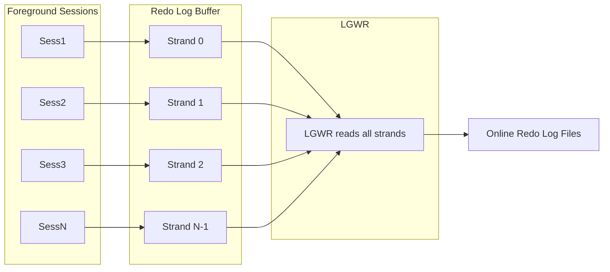

# Redo Internals

## Overview

Redo is Oracle's write-ahead log — the sequence of change vectors that let recovery replay any committed transaction. But redo is much more than "a log": it's a strand-partitioned, private-buffer-optimized, IMU-accelerated, LGWR-orchestrated pipeline. Understanding it explains `log file sync`, `redo allocation`, `redo copy`, `log file switch (checkpoint incomplete)`, and why big transactions can trigger dramatically different behavior.

## Redo Record Anatomy

The atomic unit is the **redo record**. A redo record contains:

- **SCN** — assigned when the record is generated.
- **Thread#** — RAC instance (1 on non-RAC).
- **Timestamp**.
- **Length** — total bytes.
- **Change vectors** — one or more per record.

A **change vector** (CV) describes one atomic modification:

- **OP-code** — what kind of change (e.g., `5.1` = undo generation, `11.2` = insert row, `11.5` = update row, `13.28` = ITL entry).
- **DBA** — file# + block# affected.
- **Object ID**.
- **RBA** (Redo Byte Address) — position in redo stream.
- **Data** — the actual before/after image or metadata.

A single UPDATE typically generates two CVs bundled in one record:

1. Undo generation (writes the old value into an undo block).
2. Data block change (writes new value into data block).

Both must be in the same record so recovery can atomically apply the pair.

## Redo Buffer & Strands

The **redo log buffer** (`LOG_BUFFER`) sits in SGA. In modern Oracle it's not one flat buffer — it's partitioned into **strands**:



Number of **public strands** = `_log_parallelism_max` — auto-sized. Formula (approx): `CEIL(CPU_COUNT/8)`, min 2. High-commit workloads scale with strand count.

Each strand has:

- Its own **`redo allocation`** latch (guards space reservation).
- Its own **`redo copy`** latch (guards the copy into strand buffer).
- Its own subset of `LOG_BUFFER` memory.

## Redo Generation — Step-by-Step

For an UPDATE:

1. Session executes UPDATE.
2. **Reserve space** in a strand:
   - Acquire `redo allocation` latch for a strand.
   - Reserve `N` bytes for the change record.
   - Release latch.
3. **Copy** the change vectors into reserved space:
   - Acquire `redo copy` latch (usually different strand ok).
   - `memcpy` the CVs.
   - Release `redo copy` latch.
4. UPDATE completes → commit not yet issued.
5. On COMMIT:
   - Session waits for LGWR to flush all redo up to its RBA.
   - `log file sync` wait event.
   - LGWR does its cycle (see below), acknowledges.
   - Client returns.

## Private Redo Strands & IMU

For OLTP workloads with many small transactions, the public-strand path has too much latch acquisition. Oracle 10g introduced **private redo strands** + **IMU (In-Memory Undo)**:

- Each session gets a **private redo strand** — small (few hundred KB) in the shared pool.
- Small transactions write directly to their private strand (no `redo allocation` latch).
- **Undo** for small transactions goes into IMU pool (in-memory) instead of undo tablespace.
- On COMMIT: session flushes its private strand into the public strand, then LGWR takes over.

IMU controlled by `_in_memory_undo` (default TRUE). Applies only to short transactions (`_imu_pools`).

Benefits:

- Reduced `redo allocation` latch contention on high-commit OLTP.
- Undo tablespace write pressure reduced.
- Overall: 5–20% throughput gain on chatty OLTP.

Verify:

```sql
SELECT name, value FROM v$sysstat
WHERE  name IN ('IMU commits',
                'IMU undo allocation size',
                'IMU flushes',
                'redo entries',
                'redo size');
```

`IMU commits / total commits` shows how much benefit you're getting.

## LGWR — Post/Wait Model

LGWR writes filled portions of strands to online redo logs. Post/wait model:

- Foreground session commits → posts LGWR.
- LGWR wakes → drains all strands into current online redo log.
- LGWR writes → OS write completes → LGWR posts commit-waiting sessions.
- All committers get `log file sync` released together.

**Adaptive log file sync** (11.2.0.2+): sessions can either wait for LGWR post OR poll LGWR's completion. Under high commit load, polling reduces context switches. Controlled by `_use_adaptive_log_file_sync` (TRUE default).

## Log File Sync — Wait Event Breakdown

`log file sync` timing:

```
log file sync total
├── LGWR post arrival (in kernel scheduler)
└── LGWR "cycle time":
    ├── acquire redo strands
    ├── memcpy strand contents to write buffer
    ├── issue write to disk
    ├── wait for write completion (log file parallel write)
    └── post committers
```

If `log file sync` avg is 10 ms but `log file parallel write` avg is 8 ms — the extra 2 ms is scheduling / strand aggregation. Storage is the bottleneck.

If `log file sync` avg is 10 ms but `log file parallel write` avg is 2 ms — LGWR or scheduling is the bottleneck. Look at CPU pressure, `_use_single_log_writer`, adaptive log file sync tuning.

```sql
SELECT event, total_waits,
       ROUND(time_waited_micro/1e6, 1) secs,
       ROUND(time_waited_micro/GREATEST(total_waits,1)/1000, 3) avg_ms
FROM   v$system_event
WHERE  event IN ('log file sync','log file parallel write','log buffer space');
```

## Redo Byte Address (RBA)

Every redo record has an **RBA**:

- **Log sequence#** (16 bits).
- **Block#** within that log (32 bits).
- **Byte offset** within block (16 bits).

Total 64 bits identifying a position in the redo stream. RBA is monotonically increasing (log seq# up, then block# from 0 up to log size).

`V$THREAD.LAST_REDO_BLOCK` etc. show current RBA. RBAs appear in every ITL entry, every checkpoint record, every recovery message.

## Redo Log Files & Log Switch

Online redo logs are a circular set of groups. LGWR writes to `CURRENT` group; when full, log switch:

1. LGWR stops writing to current group.
2. Advance to next group (round-robin).
3. Current group's status → `ACTIVE` (still needed for instance recovery).
4. ARCn archives the just-filled log (in ARCHIVELOG mode).
5. After archive + checkpoint on all buffers containing changes from that log → `INACTIVE`.
6. Next round can reuse that group.

Statuses in `V$LOG`:

- `CURRENT` — being written.
- `ACTIVE` — full, still needed for instance recovery.
- `INACTIVE` — full, safe to reuse.
- `CLEARING` — being cleared by `ALTER DATABASE CLEAR LOGFILE`.
- `UNUSED` — never written to (freshly added).

## LGWR Workers (LGnn Slaves)

12.2+ introduced multi-worker LGWR (`LG00`, `LG01`, ...):

- Master LGWR coordinates.
- Slaves parallelize `memcpy` from strands and write submissions.
- Enabled by `_use_single_log_writer=FALSE` (single-writer path is default in 19c because it's usually faster on modern hardware).

Test both on your workload if you have doubt.

## Redo for Different Operations

| Operation                | Redo generated                                                   |
| ------------------------ | ---------------------------------------------------------------- |
| Simple INSERT/UPDATE     | Full undo + redo.                                                |
| `INSERT /*+ APPEND */`   | No undo for the inserts (loads above HWM); table remains locked. |
| NOLOGGING table + APPEND | Only "invalidation" redo (marker). Recovery loses data.          |
| Index rebuild NOLOGGING  | Same — minimal redo.                                             |
| DDL                      | Fully logged (undo + redo).                                      |
| Delayed block cleanout   | Small redo per block on next read.                               |
| Commit                   | Small — commit marker.                                           |
| Rollback                 | Applies undo records, generates additional redo.                 |

Direct-path (APPEND) writes minimize redo but require:

- Target segment locked exclusive.
- Data goes above HWM.
- Standby / DG requires `FORCE LOGGING` on primary to be safe.

## Redo Sizing — Log Switch Rate

Rule of thumb: log switch every 15–20 minutes at peak. Compute:

```sql
-- Peak redo rate (MB/s over 5 min)
SELECT ROUND(value / 5 / 60 / 1024, 2) mb_per_sec
FROM   v$sysmetric_history
WHERE  metric_name = 'Redo Generated Per Sec'
   AND intsize_csec = 6000
ORDER  BY end_time DESC
FETCH  FIRST 1 ROW ONLY;
```

Multiply by 15 \* 60 = 900 → target log size in MB.

Under-sized logs = frequent switches = `log file switch (checkpoint incomplete)` waits when DBW can't keep up.

## Standby Redo Logs

Standby databases receive redo from primary via `RFS` and write it to **standby redo logs** (SRLs) — separate from online redo logs. Required for:

- Real-time apply.
- SYNC redo transport (SYNC requires SRLs to acknowledge fast).

SRL count: `(threads × (online_groups_per_thread + 1))`. Size same as online redo.

## Redo Compression

12c+ supports `LOG_ARCHIVE_DEST_n=... COMPRESSION=ENABLE` — archived logs compressed on write. Requires Advanced Compression license. Typical 2–3× shrink.

## Common Redo-Related Wait Events

| Event                                     | Meaning                                                              |
| ----------------------------------------- | -------------------------------------------------------------------- |
| `log file sync`                           | Commit waiting for LGWR persist.                                     |
| `log file parallel write`                 | LGWR write to disk.                                                  |
| `log buffer space`                        | Waiting for space in redo buffer (redo generation faster than LGWR). |
| `log file switch (checkpoint incomplete)` | Log wraparound before DBW finished checkpoint.                       |
| `log file switch (archiving needed)`      | Log wraparound before ARCn archived it.                              |
| `log file switch completion`              | Waiting for normal log switch to finish.                             |
| `redo allocation`                         | Latch contention on redo space reservation.                          |
| `redo copy`                               | Latch contention on redo memcpy.                                     |
| `log file single write`                   | Small header writes (log group creation).                            |

## Diagnostic Queries

### Redo throughput

```sql
SELECT   TO_CHAR(first_time, 'YYYY-MM-DD HH24') hr,
         COUNT(*) log_switches,
         ROUND(SUM(blocks * block_size)/1024/1024/1024, 2) gb
FROM     v$archived_log
WHERE    first_time > SYSDATE - 7
GROUP BY TO_CHAR(first_time, 'YYYY-MM-DD HH24')
ORDER BY 1;
```

### Redo per session (top writers)

```sql
SELECT   s.sid, s.username, s.program,
         se.value redo_size_bytes,
         ROUND(se.value/1024/1024, 2) redo_mb
FROM     v$session s
JOIN     v$sesstat se ON se.sid = s.sid
JOIN     v$statname sn ON sn.statistic# = se.statistic#
WHERE    sn.name = 'redo size'
   AND   se.value > 100*1024*1024
ORDER BY se.value DESC;
```

### Strand-level activity

```sql
SELECT   name, gets, misses, sleeps
FROM     v$latch_children
WHERE    name IN ('redo allocation','redo copy')
ORDER BY name, child#;
```

### IMU / private strand benefit

```sql
SELECT name, value FROM v$sysstat
WHERE  name IN ('IMU commits','IMU flushes',
                'IMU Redo allocation size','redo entries','redo size');
```

## Related

- [LGWR](../25-reference/background-processes/lgwr.md).
- [Redo Architecture](../06-redo/redo-architecture.md).
- [Redo Tuning](../06-redo/redo-tuning.md).
- [Commit Processing](../06-redo/commit-processing.md).
- [Undo & CR Internals](undo-cr-internals.md).
- [Block Format & ITL](block-format-itl.md).
- [SCN](scn.md).
- [Commit Wait Events](../25-reference/wait-events/commit.md).
