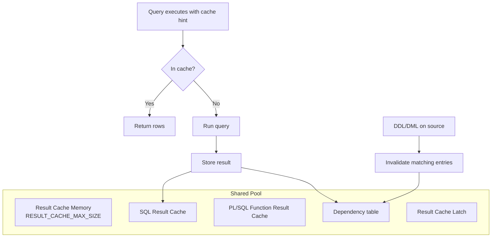

# Result Cache Internals

## Overview

The **Server Result Cache** is a shared-pool region that caches the **result set** (rows, not just plans) of designated SQL queries and PL/SQL function calls. When a subsequent execution matches, Oracle returns the cached rows without touching data blocks — potentially millisecond savings per call. But the cache is protected by a **single latch**, dependency-tracked, and invalidated on any DDL/DML to the source tables. Misuse creates a global bottleneck.

This page walks the mechanics: internal structure, latch/mutex protection, dependency tracking, invalidation triggers, and when the feature helps vs hurts.

## Structure



Two sub-caches share the memory:

- **SQL Result Cache** — rows returned by `SELECT` with `/*+ RESULT_CACHE */` hint or under `RESULT_CACHE_MODE = FORCE`.
- **PL/SQL Function Result Cache** — return values of functions declared `RESULT_CACHE`.

## Enabling

Init parameters:

```sql
SHOW PARAMETER result_cache
```

- **`RESULT_CACHE_MODE`** — `MANUAL` (default), `FORCE`, `AUTO`. FORCE caches every eligible query — usually a mistake.
- **`RESULT_CACHE_MAX_SIZE`** — size of the cache region. Auto-sized to ~0.25% of shared pool if 0.
- **`RESULT_CACHE_MAX_RESULT`** — max % of cache one result can consume (default 5%).
- **`RESULT_CACHE_REMOTE_EXPIRATION`** — for results using DB links, expire after N minutes.

Query-level hint:

```sql
SELECT /*+ RESULT_CACHE */ id, name FROM products WHERE category = 'BOOKS';
```

PL/SQL function:

```sql
CREATE OR REPLACE FUNCTION get_shipping(country VARCHAR2) RETURN NUMBER
   RESULT_CACHE RELIES_ON (shipping_rates)
IS
   v_rate NUMBER;
BEGIN
   SELECT rate INTO v_rate FROM shipping_rates WHERE cc = country;
   RETURN v_rate;
END;
/
```

`RELIES_ON` explicitly declares dependencies (pre-12c); in 12c+ Oracle auto-detects.

## Cache Entry Anatomy

Each cache entry has:

- **Hash key** — normalized SQL text or PL/SQL function signature + argument values.
- **Dependency list** — every table/object it depends on.
- **Result** — the rows / return value (compressed).
- **Metadata** — timestamps, invalidation count, hit count.

Query entries:

```sql
SELECT id, type, status, name, object_no,
       hits, invalidations, block_count,
       creation_timestamp, DIRTY, EDITION
FROM   v$result_cache_objects
ORDER  BY hits DESC
FETCH  FIRST 20 ROWS ONLY;
```

`STATUS`:

- `NEW` — being created.
- `PUBLISHED` — available for reuse.
- `INVALID` — dependency changed, waiting for eviction.
- `EXPIRED` — TTL expired (remote result cache).

## The Result Cache Latch

**One latch protects the entire result cache**. Every cache lookup, insertion, and invalidation goes through it.

Under heavy hit rate (many concurrent lookups), the latch becomes a serialization point. Wait event: `latch: Result Cache: RC Latch`.

```sql
SELECT gets, misses, sleeps, wait_time
FROM   v$latch
WHERE  name = 'Result Cache: RC Latch';
```

This is why `RESULT_CACHE_MODE=FORCE` on high-concurrency workloads is destructive — every SELECT hits the same latch.

## Invalidation Cascade

When DML or DDL changes a source object:

1. Session finishes the DML.
2. On commit, dependency table walks entries referencing that object.
3. All matching entries → `INVALID`.
4. Next query for the same entry → miss, re-execute.
5. Later, memory pressure evicts INVALID entries.

Consequences:

- Cache is best for **read-heavy** data (lookup tables, reference data).
- Frequently-updated tables invalidate constantly — cache thrashes, no benefit.

Verify invalidation rate:

```sql
SELECT   name, hits, invalidations
FROM     v$result_cache_objects
WHERE    type = 'Result'
ORDER BY invalidations DESC
FETCH FIRST 20 ROWS ONLY;
```

## Memory Management

`RESULT_CACHE_MAX_SIZE` sets the ceiling. When full:

1. Try to evict INVALID entries.
2. Try to evict LRU PUBLISHED entries.
3. If no room → skip caching (query runs normally, uncached).

Statistics:

```sql
SELECT name, value FROM v$result_cache_statistics ORDER BY name;
```

Key stats:

- **`Block Size (Bytes)`** — internal chunk size.
- **`Block Count Maximum`** — RESULT_CACHE_MAX_SIZE / block size.
- **`Block Count Current`** — current usage.
- **`Result Size Maximum (Blocks)`** — max blocks per single result.
- **`Create Count Success`** — cache-worthy queries stored.
- **`Create Count Failure`** — couldn't fit (or blocked).
- **`Find Count`** — cache hits.
- **`Invalidation Count`** — invalidations processed.
- **`Delete Count Invalid/Valid`** — evictions.

Hit ratio:

```sql
SELECT ROUND(
   (SELECT value FROM v$result_cache_statistics WHERE name = 'Find Count') /
   NULLIF((SELECT value FROM v$result_cache_statistics WHERE name = 'Find Count') +
          (SELECT value FROM v$result_cache_statistics WHERE name = 'Create Count Success'), 0)
   * 100, 2) hit_pct
FROM dual;
```

`> 70%` = beneficial. `< 30%` = probably hurting.

## Dependency Tracking

`V$RESULT_CACHE_DEPENDENCY`:

```sql
SELECT   d.result_id, d.depend_id, o.name object,
         o.type object_type
FROM     v$result_cache_dependency d
JOIN     v$result_cache_objects o ON o.id = d.depend_id
FETCH FIRST 30 ROWS ONLY;
```

## PL/SQL Function Result Cache — Deeper

PL/SQL result cache has its own semantics:

- **Cache scope**: cluster-wide (all sessions on same instance share).
- **Cache key**: function args (must be scalar; RECORD/OBJECT not supported).
- **Invalidation**: on DML/DDL to `RELIES_ON` tables (or auto-detected sources in 12c+).
- **Non-deterministic functions**: results still cached — but only if you mark `DETERMINISTIC` (compiler enforcement). Marking a function `RESULT_CACHE` implies determinism given inputs + source tables.

Hit example — first call runs; second call with same args returns cached:

```sql
BEGIN
  DBMS_OUTPUT.PUT_LINE(get_shipping('US'));   -- runs
  DBMS_OUTPUT.PUT_LINE(get_shipping('US'));   -- from cache
END;
/
```

## When Result Cache Helps

- **Lookup / reference tables** — small, rarely-changed data, hit by many queries.
- **Materialized-view-like patterns** — aggregate queries hit many times.
- **PL/SQL functions in tight loops** — same args, same result.

## When It Hurts

- **`RESULT_CACHE_MODE=FORCE`** — every eligible query caches; latch bottleneck.
- **High-DML source tables** — invalidations dominate.
- **Non-shared parameters** — bind variable values that vary; only exact match hits.
- **Small results returning many rows** — cache overhead > query cost.

## Diagnostic Recipes

### List cached results by object

```sql
SELECT   o.name, o.type, o.status,
         o.hits, o.invalidations, o.creation_timestamp
FROM     v$result_cache_objects o
WHERE    type = 'Result'
ORDER BY hits DESC
FETCH FIRST 30 ROWS ONLY;
```

### Wasteful entries (created but never hit)

```sql
SELECT o.name, o.hits, o.invalidations, o.creation_timestamp
FROM   v$result_cache_objects o
WHERE  o.type = 'Result' AND o.hits = 0
ORDER  BY o.creation_timestamp DESC
FETCH  FIRST 20 ROWS ONLY;
```

### Objects that trigger most invalidations

```sql
SELECT   o.name dependency_object,
         COUNT(*) invalidations_caused
FROM     v$result_cache_dependency d
JOIN     v$result_cache_objects o ON o.id = d.depend_id
JOIN     v$result_cache_objects r ON r.id = d.result_id
WHERE    r.status = 'Invalid'
GROUP BY o.name
ORDER BY 2 DESC;
```

### RC Latch contention

```sql
SELECT name, gets, misses, sleeps,
       ROUND(misses*100/GREATEST(gets,1), 3) miss_pct
FROM   v$latch
WHERE  name = 'Result Cache: RC Latch';
```

## Management Operations

Flush entire cache:

```sql
BEGIN
  DBMS_RESULT_CACHE.FLUSH;
END;
/
```

Invalidate specific dependency:

```sql
BEGIN
  DBMS_RESULT_CACHE.INVALIDATE(owner => 'APP', name => 'SHIPPING_RATES');
END;
/
```

Bypass for a session:

```sql
ALTER SESSION SET result_cache_mode = MANUAL;
```

## Interview Framing

> "What is the server result cache?"

Shared-pool region caching the row output of `RESULT_CACHE`-hinted queries and PL/SQL function results. Hits return cached rows without touching data blocks. Dependency-tracked so DML on source tables invalidates matching entries.

> "Why is `RESULT_CACHE_MODE=FORCE` dangerous?"

Every eligible query attempts to cache and hit through a single latch. On high-concurrency systems, `latch: Result Cache: RC Latch` becomes a global serialization point.

> "When is result cache useful?"

Read-heavy reference data, small result sets, many repeated executions. Poor fit for high-DML tables or highly-varied bind values.

## Related

- [Result Cache](../03-instance-architecture/memory/result-cache.md).
- [Shared Pool](../03-instance-architecture/memory/shared-pool.md).
- [Memory Parameters](../25-reference/initialization-parameters/memory-parameters.md).
- [Latches vs Mutexes](latches-vs-mutexes.md).
- [Library Cache](library-cache.md).
