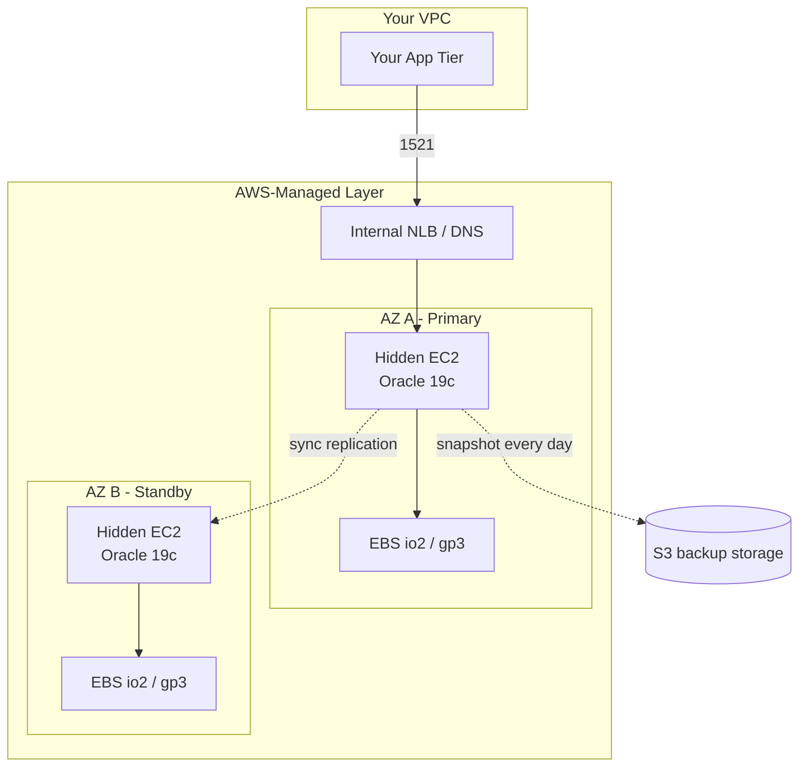

# RDS Oracle Architecture

## What AWS Provisions

Each RDS Oracle instance is:

- A **hidden EC2 instance** (in AWS's own VPC, not yours).
- **EBS volumes** backing the database.
- **A managed Oracle installation** — full 19c EE or SE2.
- **AWS RDS control plane** — API, monitoring, backup service.
- **Network endpoints** — the RDS URL you connect to; often behind an internal ELB for Multi-AZ.

## Access Model

You **never** get:

- SSH into the EC2.
- File system access (except via `rdsadmin` procedures).
- SYS / SYSDBA privileges.
- Root or `oracle` OS user.
- Direct access to trace files (download via CLI/API only).

You **do** get:

- Master user with `RDS_MASTER_USER` role — quasi-DBA privileges.
- SQL client access on 1521.
- `rdsadmin` package for admin ops.
- CloudWatch metrics.
- Parameter groups (subset of init parameters).

## Multi-AZ HA

Different from Oracle Data Guard:

- **AWS-proprietary block-level replication** at storage layer (not redo apply).
- Standby is not open — no read scaling.
- **Automatic failover** in 60–120 s by DNS flip.
- No control over sync mode — it's always synchronous in commit path.

Multi-AZ ≠ Data Guard. Different guarantees, different observability.

## Read Replicas

Cross-region or cross-AZ. **Asynchronous** — uses actual Oracle Data Guard under the covers (this one **is** DG).

You can promote a read replica to master (breaks replication, becomes independent).

## Storage

- **gp3** — general purpose. Baseline 3000 IOPS, up to 16k, throughput up to 1 GB/s.
- **io1** — legacy provisioned IOPS.
- **io2** — modern PIOPS. Up to 256k IOPS. Sub-ms latency.
- **Magnetic** — deprecated.

Volume type + IOPS = the biggest tunable in RDS. Storage autoscaling extends size (not IOPS).

## Storage Encryption

- **Always at rest** with KMS.
- Choose the KMS key at create time (customer-managed or AWS-managed).
- Cannot enable encryption after create — must recreate from snapshot.

## Parameter Groups

Layered config:

- **Default parameter group** — AWS-provided, locked.
- **Custom parameter group** — you create, associate with instance.

Not all Oracle params are exposed. AWS blocks:

- Memory sizing (controlled by instance class).
- Some redo log settings.
- Cluster-related params.

Some are "dynamic" (immediate) vs "pending-reboot".

## Backup / Restore

- **Automated snapshot** daily during backup window.
- **Transaction logs** continuously → PITR.
- **Manual snapshot** on-demand.
- **Cross-region snapshot copy**.

See [RDS Backups](rds-backups.md).

## Networking

- Instance lives in a DB Subnet Group (private subnets across AZs).
- Security Group controls what can connect on 1521.
- No direct connectivity from external — you must SSH-tunnel from a bastion.

## Upgrades

- AWS **notifies** you of new versions (RUs, minor version bumps).
- You choose a maintenance window; AWS applies during that window.
- **Auto minor version upgrade** = opt-in.
- Major version upgrades (e.g., 19c → 21c) require manual initiation via console/API.

Downtime: a few minutes for the reboot.

## Related

- [Overview (Cloud chapter)](../29-cloud/aws-rds/overview.md).
- [Backups](rds-backups.md).
- [Monitoring](rds-monitoring.md).
- [Limitations](rds-limitations.md).
