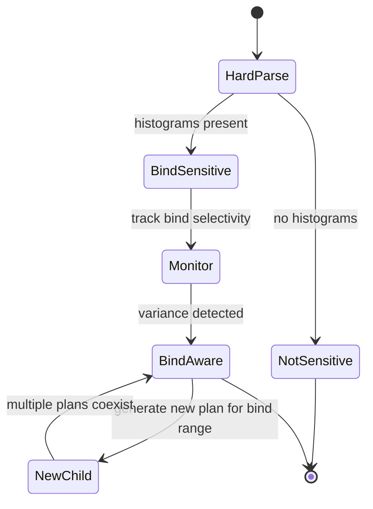

# Adaptive Cursor Sharing (ACS)

## Overview

**Adaptive Cursor Sharing** (ACS), introduced in 11g, addresses the [bind peeking](bind-peeking.md) instability problem. Oracle tracks per-bind selectivity across executions and can generate multiple **bind-aware** child cursors — different plans for different bind-value ranges — automatically.

## When ACS Kicks In

Prerequisites:

1. **SQL has bind variables**.
2. **Referenced columns have histograms** — makes the optimizer flag the SQL as `IS_BIND_SENSITIVE = Y`.
3. **Executions show cardinality variance** — Oracle notices "the estimate was way off for this bind value".

## Lifecycle



## Statistics ACS Uses

Per parent cursor:

- **Selectivity cube** — recent binds' selectivity mapped to plan choice.

Per child cursor:

- **Bind-value profile** — the range of bind values this child is optimized for.

## Detecting ACS in V$SQL

```sql
SELECT sql_id, child_number, plan_hash_value,
       is_bind_sensitive, is_bind_aware, is_shareable,
       executions, buffer_gets, elapsed_time
FROM   v$sql
WHERE  sql_id = '&sql_id'
ORDER  BY child_number;
```

- `IS_BIND_SENSITIVE=Y` + `IS_BIND_AWARE=N` — Oracle flagged the SQL, hasn't yet split.
- `IS_BIND_SENSITIVE=Y` + `IS_BIND_AWARE=Y` — ACS is actively managing multiple bind-aware children.

```sql
-- Per-child bind info
SELECT sql_id, child_number, peeked, bind_name, position,
       datatype_string, value_string
FROM   v$sql_bind_capture
WHERE  sql_id = '&sql_id'
ORDER  BY child_number, position;

-- Selectivity cube
SELECT sql_id, child_number, low, high, ROUND(predicate,4) selectivity, executions
FROM   v$sql_cs_selectivity
WHERE  sql_id = '&sql_id'
ORDER  BY child_number;
```

## When ACS Helps

- Skewed columns queried with different values.
- Long-running queries where the extra parse cost pays off.
- ETL where one query hits both narrow (few rows) and wide (many rows) ranges.

## When ACS Hurts

- **Plan proliferation** — dozens of children for one SQL_ID, shared pool pressure.
- **Slow convergence** — takes several executions to notice variance.
- **Bind capture noise** — some workloads generate too many bind-aware cursors.

Common workaround for problem cases:

```sql
-- Set at session level for that SQL
ALTER SESSION SET "_optimizer_adaptive_cursor_sharing" = FALSE;
```

Never disable ACS globally without measured cause.

## Interaction with SPB

If a **SQL Plan Baseline** is loaded, it typically wins over ACS. ACS suggests a plan, but SPB says "use this plan" — Oracle uses SPB. Exception: if the SPB plan is `NON-REPRODUCIBLE`, ACS's plan may win.

## Interaction with SQL Profile

SQL profile hints modify the optimizer's estimates. ACS can still activate on top, generating different children with the profile hints applied.

## Detecting ACS Overhead

```sql
-- Count children per SQL_ID
SELECT sql_id, COUNT(*) child_count
FROM   v$sql
GROUP  BY sql_id
HAVING COUNT(*) > 5
ORDER  BY 2 DESC
FETCH  FIRST 20 ROWS ONLY;
```

If a SQL has 20+ children, ACS is probably churning. Investigate via `V$SQL_SHARED_CURSOR` (row per child, columns explain why each was created).

## Tuning Parameters

Rarely touched:

- `_bloom_filter_enabled`
- `_optimizer_adaptive_cursor_sharing` (TRUE default)
- `_optimizer_adaptive_features` (12.1 covers ACS + AP + adaptive stats)
- `_optim_peek_user_binds` (bind peeking master switch)

## Best Practices

1. Let ACS work — don't disable globally.
2. Use SPB for critical SQLs so ACS doesn't cause plan flips.
3. Monitor cursor children counts; investigate outliers.
4. For a SQL with pathological ACS behavior, use a hint or SPB rather than turning off ACS.
5. When troubleshooting an ACS-related regression, capture `V$SQL_CS_SELECTIVITY` — it shows the bind ranges Oracle decided to split on.

## Interview Framing

> "How does Oracle handle skewed data with bind variables?"

Answer: Bind peeking picks a plan on first hard parse. Adaptive Cursor Sharing then tracks bind selectivity across executions; if variance is significant, it flags the cursor as bind-aware and generates additional child plans for different bind ranges — automatic plan-per-range without the DBA rewriting the query.

## Related

- [Bind Peeking](bind-peeking.md).
- [Cursor Internals](../32-internals-deep-dive/cursor-internals.md).
- [SQL Plan Management](../11-sql-optimizer/sql-plan-management.md).
- [Histograms](../11-sql-optimizer/histograms.md).
