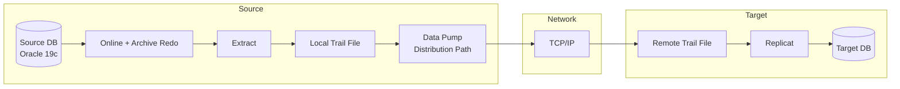

# GoldenGate Architecture

## Overview

GoldenGate flows logical changes through a pipeline of processes and disk trail files. Different pieces run on source and target. The key insight: GoldenGate is **asynchronous replay**, not synchronous replication.

## The Flow



## Processes

### Extract

Reads source redo, mines DML/DDL for tables listed in the config, writes to a **local trail file**. Two modes:

- **Classic Extract** — reads redo directly.
- **Integrated Extract** — 11.2.0.3+; uses `DBMS_LOGMNR` inside the source DB, more robust for LOBs, IOTs, multitenant. Requires source DB to run at compatible=11.2+ and `enable_goldengate_replication=TRUE`.

### Data Pump (GoldenGate)

Reads local trail file, ships over TCP to target's remote trail file. **Not** related to Oracle Data Pump export/import.

### Server Collector (Target)

Receives from Data Pump, writes remote trail file. Runs implicitly on target.

### Replicat

Reads remote trail file, generates and executes SQL against target DB. Two modes:

- **Classic Replicat** — single-threaded (or a few parallel replicats you manage).
- **Integrated Replicat** — 12c+ target, orchestrates parallel apply via `LogMiner`+`XStream`. Recommended.

### Manager

The daemon on each host — starts/stops/monitors Extract, Replicat, and other processes. Runs on both source and target.

## Trail Files

Binary format, sequenced (`ab000001, ab000002`). Two kinds:

- **Local trail** — Extract's output on source.
- **Remote trail** — Data Pump's output on target.

Retention until the reader (Data Pump or Replicat) confirms it's done with them. Kept in a directory usually `$OGG_HOME/dirdat/`.

## Configuration Files

Parameter files live in `$OGG_HOME/dirprm/`, extension `.prm`:

- `mgr.prm` — manager.
- `<extract_name>.prm` — extract config.
- `<datapump_name>.prm` — data pump config.
- `<replicat_name>.prm` — replicat config.

## GGSCI — Command-Line Interface

```
GGSCI> info all
GGSCI> start manager
GGSCI> start extract e_prd
GGSCI> stats extract e_prd
GGSCI> view report e_prd
GGSCI> lag replicat r_prd
```

Newer Microservices Architecture uses a web UI instead of GGSCI.

## Positioning — SCN and Trail Sequence

Extract remembers its position in redo — an SCN. Replicat remembers its position in the remote trail. Both survive restart.

If Extract falls behind, redo continues to accumulate. Local trail also grows. Data Pump ships them across. Eventually catches up.

If Replicat falls behind (application slow, target IO), remote trail grows.

## Handling DDL

GoldenGate can replicate DDL — `ADD SCHEMATRANDATA`, `DDL INCLUDE ALL` in extract param. Integrated Extract handles DDL more robustly.

## Multi-Node Extract / Replicat

- **Coordinated Replicat** — 12.2+, multiple replicats coordinated for parallel apply with dependency preservation.
- **Multi-threaded Extract** — Integrated Extract can leverage LogMiner parallelism.

## Deployment Topology Examples

### Migration (One-Way)

```
Old (source) --Extract--> Local trail --Data Pump--> Remote trail --Replicat--> New (target)
```

Both DBs are open for reads/writes until cutover. Turn off Replicat = frozen target.

### Bi-Directional Active-Active

Two extracts (source1→target1, source2→target2) and two replicats. Conflict resolution rules needed.

### Cascade (Hub-and-Spoke)

One source → multiple destinations.

## Related

- [Extract](extract.md).
- [Replicat](replicat.md).
- [Troubleshooting](troubleshooting.md).
