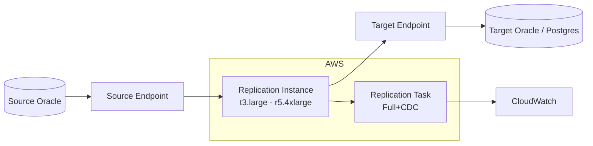

# AWS Database Migration Service (DMS)

## Overview

**AWS DMS** migrates data between databases — Oracle → Oracle, Oracle → PostgreSQL, Oracle → Aurora, on-prem → RDS, RDS → RDS, and more. It runs on a **Replication Instance** (EC2 managed by AWS), reads source via native APIs, and writes to target.

Two migration types:

- **Full load** — one-shot copy.
- **Full load + CDC** — full load, then ongoing change data capture.
- **CDC only** — assumes target already populated.

## Common Scenarios

- On-prem Oracle → AWS RDS Oracle (cutover with CDC).
- Oracle → Aurora PostgreSQL (heterogeneous, uses Schema Conversion Tool).
- Oracle → S3 (data lake ingest).
- Cross-region RDS Oracle replication.

## Architecture



## Setup Steps

### 1. Create Source Endpoint

```bash
aws dms create-endpoint \
    --endpoint-identifier prd-oracle-src \
    --endpoint-type source \
    --engine-name oracle \
    --username dms_user \
    --password '<pw>' \
    --server-name source-db01.example.com \
    --port 1521 \
    --database-name PRD
```

Grant on source:

```sql
CREATE USER dms_user IDENTIFIED BY <pw>;
GRANT CONNECT, RESOURCE TO dms_user;
GRANT SELECT ANY TABLE TO dms_user;
GRANT SELECT ANY DICTIONARY TO dms_user;
GRANT LOGMINING TO dms_user;
GRANT CREATE ANY DIRECTORY TO dms_user;
GRANT EXECUTE ON DBMS_LOGMNR TO dms_user;
-- For CDC via LogMiner (recommended)
```

Enable supplemental logging:

```sql
ALTER DATABASE ADD SUPPLEMENTAL LOG DATA;
ALTER DATABASE ADD SUPPLEMENTAL LOG DATA (PRIMARY KEY) COLUMNS;
```

### 2. Create Target Endpoint

Similar — user with WRITE + CREATE privileges on target schema.

### 3. Create Replication Instance

```bash
aws dms create-replication-instance \
    --replication-instance-identifier prd-migration \
    --replication-instance-class dms.r5.2xlarge \
    --allocated-storage 200 \
    --publicly-accessible false \
    --vpc-security-group-ids sg-xxxx \
    --replication-subnet-group-identifier my-subnet-group
```

### 4. Create Replication Task

```bash
aws dms create-replication-task \
    --replication-task-identifier prd-migrate-task \
    --source-endpoint-arn arn:aws:dms:...:endpoint/prd-oracle-src \
    --target-endpoint-arn arn:aws:dms:...:endpoint/prd-oracle-tgt \
    --replication-instance-arn arn:aws:dms:...:rep:prd-migration \
    --migration-type full-load-and-cdc \
    --table-mappings file://table-mappings.json \
    --replication-task-settings file://task-settings.json
```

### Task Settings — Consistency

Critical for consistent migration:

```json
{
  "TargetMetadata": {
    "SupportLobs": true,
    "FullLobMode": false,
    "LimitedSizeLobMode": true,
    "LobMaxSize": 32,
    "TargetSchema": ""
  },
  "FullLoadSettings": {
    "TargetTablePrepMode": "TRUNCATE_BEFORE_LOAD",
    "MaxFullLoadSubTasks": 8,
    "TransactionConsistencyTimeout": 600,
    "CommitRate": 10000
  },
  "ChangeProcessingTuning": {
    "MinTransactionSize": 1000,
    "CommitTimeout": 1
  },
  "ValidationSettings": {
    "EnableValidation": true,
    "ThreadCount": 8,
    "ValidationMode": "ROW_LEVEL"
  }
}
```

`TransactionConsistencyTimeout: 600` = DMS waits 10 min for open transactions before starting CDC → smaller SCN gap between full load and CDC.

### Table Mappings

```json
{
  "rules": [
    {
      "rule-type": "selection",
      "rule-id": "1",
      "rule-name": "1",
      "object-locator": {
        "schema-name": "APP",
        "table-name": "%"
      },
      "rule-action": "include"
    }
  ]
}
```

### Start Task

```bash
aws dms start-replication-task \
    --replication-task-arn arn:aws:dms:...:task:prd-migrate-task \
    --start-replication-task-type start-replication
```

## Monitoring

CloudWatch metrics per task:

- `FullLoadThroughputBandwidthTarget`.
- `CDCLatencySource` — how far source is ahead of DMS.
- `CDCLatencyTarget` — how far DMS is ahead of target.
- `CDCIncomingChanges`.

Task-level:

```bash
aws dms describe-replication-tasks \
    --filters Name=replication-task-id,Values=prd-migrate-task
```

Table statistics:

```bash
aws dms describe-table-statistics --replication-task-arn ...
```

Shows rows loaded/inserted/updated/deleted per table + validation results.

## Validation

DMS can validate row-by-row match between source and target:

```json
"ValidationSettings": {
  "EnableValidation": true,
  "ThreadCount": 8,
  "ValidationMode": "ROW_LEVEL"
}
```

Results in `awsdms_validation_failures_v1` on target. Sample rows that don't match are flagged.

## Common Issues

- **LOB truncation** — DMS default LOB mode truncates. Use `LimitedSizeLobMode` with sufficient `LobMaxSize`, or `FullLobMode` (slower).
- **Timestamp precision loss** — `TIMESTAMP(9)` → `TIMESTAMP(6)` in some target types.
- **SCN gap between full load and CDC** — set `TransactionConsistencyTimeout` high.
- **Missed DDL** — DMS supports basic DDL but not everything; DDL changes during migration are risky.
- **Character set differences** — force conversion in target endpoint.
- **Task fails** — check CloudWatch Logs, `awsdms_apply_exceptions` on target.

## Best Practices

1. Test in dev with a real subset first.
2. Match replication instance class to source workload.
3. Use CDC-only mode when you can pre-load with Data Pump for large tables.
4. Enable validation for critical tables — don't blindly trust DMS.
5. LOB settings: `LimitedSizeLobMode` with `LobMaxSize` = max expected LOB, for speed.
6. Reconcile row counts + checksums at cutover.
7. Have a **rollback plan** — source stays running until cutover confirmed good.
8. Monitor CDC latency during cutover window.

## When DMS Isn't Right

- Very-large migrations (10+ TB) — GoldenGate more predictable.
- Cross-endian complex — TTS or XTTS.
- Complex PL/SQL migrations — SCT + manual.
- Strict consistency needed for critical tables during CDC.

## Related

- [Migration Methods](../23-upgrade-migration/migration-methods.md).
- [DMS Migration Issues case study](../34-real-world-case-studies/dms-migration-issues.md).
- [GoldenGate](../37-goldengate/index.md).
- AWS DMS documentation.
