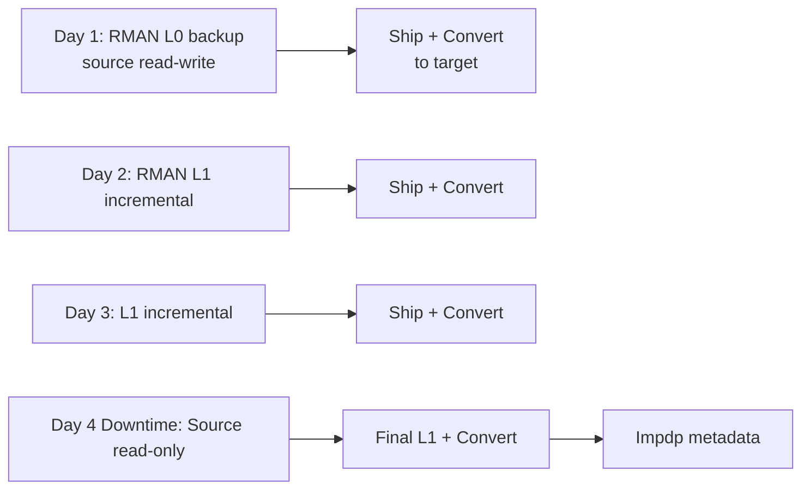

# Transportable Tablespaces (TTS / XTTS)

## Overview

**Transportable Tablespaces** move data by shipping the physical datafiles + a metadata dump — far faster than logical Data Pump for large data. Two flavors:

- **TTS** — same endian (Linux → Linux, Windows → Linux via 32/64 bit both little-endian).
- **XTTS** — cross-endian (AIX big-endian → Linux little-endian). Uses RMAN `CONVERT`.

Both preserve indexes, statistics, and constraints "for free" (they're in the datafile blocks) — no need to rebuild after import.

## Constraints

- Same **DB_BLOCK_SIZE** (or use non-default block size pools).
- Same **NLS_CHARACTERSET** (or target must be a superset).
- Same or higher **COMPATIBLE** on target.
- No unlogged direct-path inserts in the tablespace during the operation.
- Tablespaces must be **self-contained** (no dependencies on other user tablespaces).

## Basic Flow (Same Endian)

### 1. Verify Self-Containment

```sql
BEGIN
  DBMS_TTS.TRANSPORT_SET_CHECK('USERS_DATA,USERS_IDX', TRUE);
END;
/

SELECT * FROM transport_set_violations;
-- Should return zero rows
```

### 2. Make Source Tablespaces Read-Only

```sql
ALTER TABLESPACE USERS_DATA READ ONLY;
ALTER TABLESPACE USERS_IDX  READ ONLY;
```

### 3. Export Metadata

```bash
expdp system/... transport_tablespaces=USERS_DATA,USERS_IDX \
      directory=DP_DUMP dumpfile=tts_meta.dmp logfile=tts_meta.log
```

### 4. Copy Datafiles to Target

```bash
scp /u01/oradata/PRD/users_data01.dbf target:/u01/oradata/TGT/
scp /u01/oradata/PRD/users_idx01.dbf  target:/u01/oradata/TGT/
scp /u01/dumps/tts_meta.dmp target:/u01/dumps/
```

### 5. Import at Target

```bash
# On target
impdp system/... directory=DP_DUMP dumpfile=tts_meta.dmp \
      transport_datafiles='/u01/oradata/TGT/users_data01.dbf,/u01/oradata/TGT/users_idx01.dbf' \
      logfile=tts_impdp.log \
      remap_schema=APP:APP
```

### 6. Verify + Bring Online

```sql
SELECT tablespace_name, status FROM dba_tablespaces
WHERE  tablespace_name IN ('USERS_DATA','USERS_IDX');

ALTER TABLESPACE USERS_DATA READ WRITE;
ALTER TABLESPACE USERS_IDX  READ WRITE;
```

### 7. Restore Source (Optional)

```sql
-- Back on source
ALTER TABLESPACE USERS_DATA READ WRITE;
ALTER TABLESPACE USERS_IDX  READ WRITE;
```

## Cross-Platform (XTTS Basic)

Add RMAN `CONVERT` between source and target:

```
RMAN> CONVERT TABLESPACE 'USERS_DATA','USERS_IDX'
      TO PLATFORM 'Linux x86 64-bit'
      FORMAT '/u01/xtts/%U';
```

Copies + converts datafiles to little-endian. Ship the converted files instead of originals.

## XTTS Incremental Backup Method (Very Large DBs)

For 10 TB+ where "source read-only for 4 hours" isn't acceptable, use the **XTTS incremental** pattern (MOS Doc ID 2005729.1):



**Downtime = final L1 + metadata import** (typically 30–60 min instead of hours).

## MOS-Guided Scripts

Oracle provides scripts (`rman_xttconvert_2.0.zip` via MOS 2005729.1):

- `xttdriver.pl` — orchestrates the whole flow.
- Configurable, handles ASM, cross-platform mapping.

Recommended over homegrown scripts.

## Post-Import Checks

- **Analyze**: stats are preserved but object numbers reset — some sites regather:
  ```sql
  EXEC DBMS_STATS.GATHER_SCHEMA_STATS('APP');
  ```
- **Constraints**: verify FKs are ENABLED VALIDATED.
- **Indexes**: check `DBA_INDEXES.STATUS` all VALID.
- **Sequences**: separately export/import; TTS doesn't carry sequences.

## Common Issues

- **`ORA-29308: TRANSPORT_SET_CHECK failure`** — Tablespace has objects referring to other tablespaces. Include the missing ones.
- **`ORA-19722: datafile is not correct version`** — Missing RMAN CONVERT (cross-endian) or wrong header.
- **Sequences not moved** — Expected. Add `SEQUENCES` to a separate Data Pump export.
- **Grants missing** — TTS moves objects, not grants. Separately export/import roles + grants.
- **Charset mismatch** — Charset must match or target be a superset.

## When TTS Isn't Right

- Small DBs (< 200 GB) — Data Pump is simpler.
- Reshaping data during move (rename schemas, change tablespaces) — Data Pump.
- Uncertain source stability — take an RMAN backup first.

## Related

- [Migration Methods](../23-upgrade-migration/migration-methods.md).
- [Cross-Platform Migration](cross-platform-migration.md).
- [Data Pump](../21-data-pump/index.md).
- MOS Doc ID 2005729.1 — XTTS Incremental.
