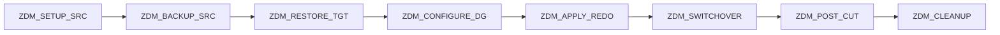

# Oracle Zero Downtime Migration (ZDM)

## Overview

**Zero Downtime Migration (ZDM)** is Oracle's automation tool for migrating Oracle databases with minimal disruption. Primary use case: **on-prem → Oracle Cloud (OCI)** — DBCS, ExaCS, ExaC@C, Autonomous.

Under the hood, ZDM chains together known Oracle tools (RMAN, Data Guard, Data Pump) with orchestration and a REST/CLI interface.

## What ZDM Does

1. **Physical**: Instantiates a target as a physical standby of source.
2. **Redo Apply**: Keeps target in sync via Data Guard.
3. **Switchover**: When ready, does role transition — minimal downtime cutover.
4. **Cleanup**: Optionally decommissions source, converts standby to primary.

Optionally supports **logical (online)** migration path using GoldenGate under the hood.

## Prerequisites

- Source DB: Oracle 11.2.0.4+ (12.1 preferred).
- Target: OCI DB Systems, ExaCS, ExaC@C, or Autonomous.
- Network: SSH from ZDM server to source; TLS/SSH to target.
- SSH keys, IAM.

## Deployment

ZDM Service host — a small Linux VM (on-prem or OCI):

```bash
# Install
./zdminstall.sh setup oraclehome=/u01/app/oracle/zdmhome \
    oraclebase=/u01/app/oracle/zdmbase \
    ziploc=/tmp/zdm.zip

# Start
zdmservice start
zdmservice status
```

## Workflows

Three main workflows via `zdmcli`:

### 1. Physical Online (Data Guard-based) — Common

```bash
zdmcli migrate database \
    -sourcesid PRD \
    -sourcedb <source-tns-alias> \
    -sourcenode source-db01 \
    -srcauth zdmauth \
    -srcarg1 user:oracle -srcarg2 identity_file:/home/opc/.ssh/id_rsa \
    -targetnode target-node1 \
    -tgtauth zdmauth \
    -tgtarg1 user:oracle -tgtarg2 identity_file:/home/opc/.ssh/id_rsa \
    -rsp /home/opc/prd_migrate.rsp \
    -eval
```

`-eval` = dry run. Confirm plan, then run without `-eval`.

Response file (`prd_migrate.rsp`):

```
TGT_DB_UNIQUE_NAME=PRD_TGT
BACKUP_PATH=nfs://backup-server/backup/PRD
MIGRATION_METHOD=ONLINE_PHYSICAL
NONCDBTOPDB_CONVERSION=TRUE
PLATFORM_TYPE=EXACS
NONCDBTOPDB_SWITCHOVER=TRUE
```

### 2. Physical Offline (RMAN Duplicate)

Simpler, requires more downtime:

```bash
zdmcli migrate database \
    -rsp offline.rsp -sourcesid PRD -sourcenode source-db01 ...
```

Response file:

```
MIGRATION_METHOD=OFFLINE_PHYSICAL
```

### 3. Logical Online (GoldenGate)

Zero-downtime for heterogeneous or non-DG-friendly targets:

```
MIGRATION_METHOD=ONLINE_LOGICAL
GOLDENGATEHUB=<hub>
```

## Phases (Physical Online)



Each phase is checkpointed. Failures resumable.

## Monitoring a Migration

```bash
# List jobs
zdmcli query job

# Detail
zdmcli query job -jobid 100

# Watch a specific phase
zdmcli query job -jobid 100 -latest
```

## Common Options

| Option                | Purpose                                 |
| --------------------- | --------------------------------------- |
| `-eval`               | Dry-run.                                |
| `-pauseafter <phase>` | Halt after a specific phase — inspect.  |
| `-genfixup`           | Generate fix-up scripts, don't execute. |
| `-listphases`         | List phases for a job.                  |
| `-abort -jobid <id>`  | Abort a running job.                    |
| `-resume -jobid <id>` | Resume after fix.                       |

## Advantages

- **Automation** — chained RMAN + DG + Data Pump with policy checks.
- **Non-CDB → PDB conversion** — automatic if requested.
- **CDB and PDB migrations** — full support.
- **Multiple databases** — batch runs.
- **Callback hooks** — customize with your scripts.

## Limitations

- Primarily OCI-target focused. Non-OCI targets less well supported.
- Source must be network-reachable from ZDM host.
- Larger migrations (10+ TB) still take hours to build the initial standby.
- Requires SSH access + significant privileges on both sides.

## When to Use ZDM

- Migrating to OCI (DBCS, ExaCS, Autonomous).
- Multiple databases moving on the same schedule.
- Standardized process wanted.

## When Not

- Target is AWS RDS — use [DMS](aws-dms.md).
- Target is on-prem non-Oracle — use GoldenGate.
- Very custom migration (unusual charset, huge object type conversion) — direct RMAN / GG.

## Related

- [Migration Methods](../23-upgrade-migration/migration-methods.md).
- [Data Guard](../17-data-guard/index.md).
- [OCI DBCS](../29-cloud/oci-dbcs/overview.md).
- MOS Doc ID 2278553.1 — ZDM Master Note.
